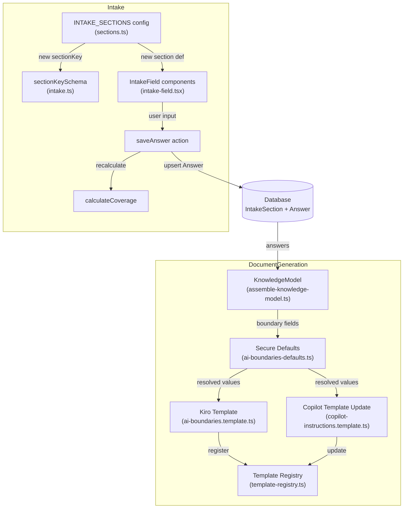

# Design Document: AI Usage Boundaries

## Overview

This feature adds a new intake section — "AI Usage, Data Handling, and Access Boundaries" — to Steering Studio's guided intake flow. The section captures governance rules for AI agent behavior: what data may appear in prompts, what local resources an agent may access, whether external AI services are permitted, how secrets and sensitive code areas are handled, developer guardrails, human approval triggers, and development OS/CLI conventions.

The section integrates with the existing `INTAKE_SECTIONS` configuration, `IntakeSection`/`Answer` Prisma models, coverage calculation, and document generation pipeline. When governance fields are omitted, the document generator applies secure defaults (restrictive by default). Generated steering documents render the answers as a policy-style section with imperative language ("must", "must not", "prohibited").

### Key Design Decisions

- **Configuration-only intake addition**: The new section is added by extending `INTAKE_SECTIONS` and the `sectionKeySchema` — no Prisma schema changes needed. The existing `IntakeSection`, `Answer`, and `IntakeField` component infrastructure handles all field types (single-select, multi-select, tag-list, short-text) without modification.
- **Secure defaults at the template layer**: Defaults are applied during document generation, not at the form/persistence layer. Answer records store only what the user explicitly provides. This keeps the data model honest and makes defaults auditable in the template code.
- **Separate Kiro template, inline Copilot section**: For Kiro output, boundaries render as a dedicated `.kiro/steering/ai-boundaries.md` file. For Copilot output, boundaries render as an additional section appended to `copilot-instructions.md`. Both use the same secure-default logic and policy-style language.
- **JSON serialization for multi-value fields**: Multi-select and tag-list values are stored as JSON string arrays in `Answer.value`, consistent with the existing `IntakeField` component's `MultiSelectField` and `TagListField` sub-components which already serialize/deserialize via `JSON.parse`/`JSON.stringify`.

## Architecture



### Module Placement

Following the existing feature-based structure, changes touch these locations:

```
src/features/intake/config/
  sections.ts                              # Add ai-usage-boundaries section definition
src/lib/validation/
  intake.ts                                # Add "ai-usage-boundaries" to sectionKeySchema
src/features/document-generation/
  lib/
    assemble-knowledge-model.ts            # Add boundary fields to KnowledgeModel + FIELD_MAPPING
    ai-boundaries-defaults.ts              # NEW: secure default resolution logic
  templates/
    kiro/
      ai-boundaries.template.ts            # NEW: Kiro boundaries template
    copilot/
      copilot-instructions.template.ts     # Update: append boundaries section
  lib/
    template-registry.ts                   # Register new Kiro template
```

## Components and Interfaces

### 1. Intake Section Configuration (`sections.ts`)

A new `IntakeSectionDef` entry is added to `INTAKE_SECTIONS` with `sectionKey: "ai-usage-boundaries"`, `sortOrder: 7` (after "Security and Compliance" at 6, before "Workflows and Team Practices" which shifts to 8), `displayName: "AI Usage, Data Handling, and Access Boundaries"`.

The section contains fields organized into 8 groups matching Requirements 2–8:

**Group 1 — Prompt and Data Handling (Req 2):**
- `allowed-prompt-data` (multi-select, optional)
- `prohibited-prompt-data` (multi-select, optional)
- `sensitive-data-redaction` (single-select, optional)
- `allowed-operational-artifacts` (tag-list, optional)
- `environment-restrictions` (single-select, optional)

**Group 2 — AI Local Access (Req 3):**
- `ai-workspace-scope` (single-select, optional)
- `prohibited-local-access` (tag-list, optional)
- `inspect-generated-files` (single-select, optional)
- `read-local-config` (single-select, optional)

**Group 3 — External AI/Model Usage (Req 4):**
- `external-model-calls` (single-select, optional)
- `approved-ai-providers` (tag-list, optional)
- `consumer-ai-tools-prohibited` (single-select, optional)
- `unmanaged-extensions-prohibited` (single-select, optional)
- `network-tenant-restrictions` (short-text, optional)

**Group 4 — Secrets and Sensitive Code (Req 5):**
- `secrets-in-prompts` (single-select, optional)
- `secret-handling-mechanism` (multi-select, optional)
- `sensitive-code-categories` (multi-select, optional)
- `ai-generate-sensitive-code` (single-select, optional)

**Group 5 — Developer Guardrails (Req 6):**
- `developer-prohibited-content` (multi-select, optional)
- `human-validation-areas` (multi-select, optional)
- `verify-ai-output-before-commit` (single-select, optional)
- `manual-review-infra-security` (single-select, optional)

**Group 6 — Approval and Escalation (Req 7):**
- `approval-before-proceed` (tag-list, optional)
- `approval-before-merge` (tag-list, optional)
- `approval-before-deploy` (tag-list, optional)
- `stop-on-unclear-boundaries` (single-select, optional)
- `escalation-contact` (short-text, optional)

**Group 7 — Development OS (Req 8):**
- `development-os` (single-select, required)
- `preferred-shell` (single-select, optional)
- `cross-platform-support` (single-select, optional)
- `examples-default-to-os` (single-select, optional)

Only `development-os` is marked as `required`. All governance fields are optional so that secure defaults can apply when omitted.

### 2. Section Key Validation (`intake.ts`)

The `sectionKeySchema` Zod enum gains `"ai-usage-boundaries"`. The existing "workflows-and-team-practices" key remains unchanged — only its `sortOrder` in the config shifts from 7 to 8.

### 3. Knowledge Model Extension (`assemble-knowledge-model.ts`)

New properties added to `KnowledgeModel`:

```typescript
// AI Usage Boundaries fields
allowedPromptData: string;
prohibitedPromptData: string;
sensitiveDataRedaction: string;
allowedOperationalArtifacts: string;
environmentRestrictions: string;
aiWorkspaceScope: string;
prohibitedLocalAccess: string;
inspectGeneratedFiles: string;
readLocalConfig: string;
externalModelCalls: string;
approvedAiProviders: string;
consumerAiToolsProhibited: string;
unmanagedExtensionsProhibited: string;
networkTenantRestrictions: string;
secretsInPrompts: string;
secretHandlingMechanism: string;
sensitiveCodeCategories: string;
aiGenerateSensitiveCode: string;
developerProhibitedContent: string;
humanValidationAreas: string;
verifyAiOutputBeforeCommit: string;
manualReviewInfraSecurity: string;
approvalBeforeProceed: string;
approvalBeforeMerge: string;
approvalBeforeDeploy: string;
stopOnUnclearBoundaries: string;
escalationContact: string;
developmentOs: string;
preferredShell: string;
crossPlatformSupport: string;
examplesDefaultToOs: string;
```

Corresponding `FIELD_MAPPING` entries map each `(sectionKey, fieldKey)` pair to its `KnowledgeModel` property. The `emptyKnowledgeModel()` function initializes all new fields to `""`.

### 4. Secure Defaults Module (`ai-boundaries-defaults.ts`)

A pure function that resolves boundary values by applying secure defaults when the knowledge model field is empty.

```typescript
interface ResolvedBoundaries {
  allowedPromptData: string[];
  prohibitedPromptData: string[];
  sensitiveDataRedaction: string;
  allowedOperationalArtifacts: string[];
  environmentRestrictions: string;
  aiWorkspaceScope: string;
  prohibitedLocalAccess: string[];
  inspectGeneratedFiles: string;
  readLocalConfig: string;
  externalModelCalls: string;
  approvedAiProviders: string[];
  consumerAiToolsProhibited: string;
  unmanagedExtensionsProhibited: string;
  networkTenantRestrictions: string;
  secretsInPrompts: string;
  secretHandlingMechanism: string[];
  sensitiveCodeCategories: string[];
  aiGenerateSensitiveCode: string;
  developerProhibitedContent: string[];
  humanValidationAreas: string[];
  verifyAiOutputBeforeCommit: string;
  manualReviewInfraSecurity: string;
  approvalBeforeProceed: string[];
  approvalBeforeMerge: string[];
  approvalBeforeDeploy: string[];
  stopOnUnclearBoundaries: string;
  escalationContact: string;
  developmentOs: string;
  preferredShell: string;
  crossPlatformSupport: string;
  examplesDefaultToOs: string;
}

function resolveBoundaries(model: KnowledgeModel): ResolvedBoundaries;
```

Secure default rules (from Requirement 9):

| Field | Default when empty |
|-------|-------------------|
| `prohibitedPromptData` | `["Customer data", "Secrets and credentials", "Production logs"]` |
| `externalModelCalls` | `"Only approved enterprise services"` |
| `aiWorkspaceScope` | `"Current repo only"` |
| `secretsInPrompts` | `"No"` |
| `humanValidationAreas` | `["Security logic", "Access control", "Infrastructure changes"]` |
| `stopOnUnclearBoundaries` | `"Yes"` |
| `verifyAiOutputBeforeCommit` | `"Yes"` |
| `manualReviewInfraSecurity` | `"Yes"` |
| `preferredShell` (when OS is Windows) | `"PowerShell"` |

For multi-select and tag-list fields, the function parses the JSON string array from the model. If parsing fails or the value is empty, the default array is used. For single-select fields, the function uses the model value if non-empty, otherwise the default string.

### 5. Kiro Boundaries Template (`ai-boundaries.template.ts`)

Renders a standalone `.kiro/steering/ai-boundaries.md` file.

```typescript
function renderAiBoundariesMd(model: KnowledgeModel): TemplateResult;
```

The template:
1. Calls `resolveBoundaries(model)` to get resolved values with defaults applied
2. Renders subsections in order (matching Requirement 10.2):
   - "Allowed Prompt Content"
   - "Prohibited Prompt Content"
   - "Local Access Scope"
   - "External AI/Model Usage Rules"
   - "Secrets and Sensitive Code Handling"
   - "Developer Usage Guardrails"
   - "Human Approval and Escalation Rules"
   - "Development Operating System and CLI Conventions"
3. Uses imperative policy language: "must", "must not", "only", "prohibited", "requires approval"
4. Avoids soft language: no "should be careful", "preferably", "generally avoid", "try not to"
5. Includes OS-aware CLI guidance based on `developmentOs` and `preferredShell` values (Requirements 11.1–11.5)

Required fields for completeness calculation: `["developmentOs"]` (the only required field).

### 6. Copilot Template Update (`copilot-instructions.template.ts`)

The existing `renderCopilotInstructionsMd` function is updated to append an "AI Usage, Data Handling, and Access Boundaries" section at the end of the generated file. It uses the same `resolveBoundaries()` function and renders the same subsections with the same policy-style language.

A shared helper function `renderBoundariesMarkdown(resolved: ResolvedBoundaries): string` is extracted to avoid duplicating rendering logic between the Kiro and Copilot templates.

### 7. Template Registry Update (`template-registry.ts`)

A new `TemplateDefinition` is registered for Kiro:

```typescript
{
  templateId: "kiro-ai-boundaries",
  filePath: ".kiro/steering/ai-boundaries.md",
  target: "kiro",
  required: false,
  render: renderAiBoundariesMd,
  isApplicable: (model) =>
    model.developmentOs.trim() !== "" ||
    model.allowedPromptData.trim() !== "" ||
    model.prohibitedPromptData.trim() !== "" ||
    model.aiWorkspaceScope.trim() !== "" ||
    model.externalModelCalls.trim() !== "",
}
```

The Copilot template does not need a separate registration — the boundaries section is rendered inline within the existing `copilot-instructions.md` template.

### 8. Sort Order Adjustment

The existing "Workflows and Team Practices" section shifts from `sortOrder: 7` to `sortOrder: 8`. The new "AI Usage, Data Handling, and Access Boundaries" section takes `sortOrder: 7`. This places it after "Security and Compliance" (6) and before "Workflows and Team Practices" (8), matching Requirement 1.3.

### 9. Shared Boundaries Renderer

A pure function extracted for reuse by both Kiro and Copilot templates:

```typescript
function renderBoundariesMarkdown(resolved: ResolvedBoundaries): string;
```

This function produces the markdown body for the boundaries section. Each template wraps it with appropriate heading levels and document structure.


## Data Models

### No Prisma Schema Changes

The existing `IntakeSection` and `Answer` models handle the new section without modification. The `IntakeSection` row is created by `initIntakeSections()` which reads from `INTAKE_SECTIONS`. The `Answer` model stores values as strings — JSON-serialized arrays for multi-select and tag-list fields, plain strings for single-select and short-text fields.

### Field Value Serialization

| Field Type | Storage Format | Example |
|-----------|---------------|---------|
| `single-select` | Plain string | `"Current repo only"` |
| `short-text` | Plain string | `"Security architect"` |
| `multi-select` | JSON string array | `'["Customer data","PHI","PII"]'` |
| `tag-list` | JSON string array | `'["~/Desktop","~/Downloads"]'` |

The existing `IntakeField` component's `MultiSelectField` and `TagListField` sub-components already handle JSON serialization/deserialization via `JSON.parse`/`JSON.stringify`. No changes to the field component are needed.

### KnowledgeModel Field Mapping

New entries in `FIELD_MAPPING` (31 fields total for the new section):

```typescript
// AI Usage, Data Handling, and Access Boundaries
{ sectionKey: "ai-usage-boundaries", fieldKey: "allowed-prompt-data", property: "allowedPromptData" },
{ sectionKey: "ai-usage-boundaries", fieldKey: "prohibited-prompt-data", property: "prohibitedPromptData" },
{ sectionKey: "ai-usage-boundaries", fieldKey: "sensitive-data-redaction", property: "sensitiveDataRedaction" },
{ sectionKey: "ai-usage-boundaries", fieldKey: "allowed-operational-artifacts", property: "allowedOperationalArtifacts" },
{ sectionKey: "ai-usage-boundaries", fieldKey: "environment-restrictions", property: "environmentRestrictions" },
{ sectionKey: "ai-usage-boundaries", fieldKey: "ai-workspace-scope", property: "aiWorkspaceScope" },
{ sectionKey: "ai-usage-boundaries", fieldKey: "prohibited-local-access", property: "prohibitedLocalAccess" },
{ sectionKey: "ai-usage-boundaries", fieldKey: "inspect-generated-files", property: "inspectGeneratedFiles" },
{ sectionKey: "ai-usage-boundaries", fieldKey: "read-local-config", property: "readLocalConfig" },
{ sectionKey: "ai-usage-boundaries", fieldKey: "external-model-calls", property: "externalModelCalls" },
{ sectionKey: "ai-usage-boundaries", fieldKey: "approved-ai-providers", property: "approvedAiProviders" },
{ sectionKey: "ai-usage-boundaries", fieldKey: "consumer-ai-tools-prohibited", property: "consumerAiToolsProhibited" },
{ sectionKey: "ai-usage-boundaries", fieldKey: "unmanaged-extensions-prohibited", property: "unmanagedExtensionsProhibited" },
{ sectionKey: "ai-usage-boundaries", fieldKey: "network-tenant-restrictions", property: "networkTenantRestrictions" },
{ sectionKey: "ai-usage-boundaries", fieldKey: "secrets-in-prompts", property: "secretsInPrompts" },
{ sectionKey: "ai-usage-boundaries", fieldKey: "secret-handling-mechanism", property: "secretHandlingMechanism" },
{ sectionKey: "ai-usage-boundaries", fieldKey: "sensitive-code-categories", property: "sensitiveCodeCategories" },
{ sectionKey: "ai-usage-boundaries", fieldKey: "ai-generate-sensitive-code", property: "aiGenerateSensitiveCode" },
{ sectionKey: "ai-usage-boundaries", fieldKey: "developer-prohibited-content", property: "developerProhibitedContent" },
{ sectionKey: "ai-usage-boundaries", fieldKey: "human-validation-areas", property: "humanValidationAreas" },
{ sectionKey: "ai-usage-boundaries", fieldKey: "verify-ai-output-before-commit", property: "verifyAiOutputBeforeCommit" },
{ sectionKey: "ai-usage-boundaries", fieldKey: "manual-review-infra-security", property: "manualReviewInfraSecurity" },
{ sectionKey: "ai-usage-boundaries", fieldKey: "approval-before-proceed", property: "approvalBeforeProceed" },
{ sectionKey: "ai-usage-boundaries", fieldKey: "approval-before-merge", property: "approvalBeforeMerge" },
{ sectionKey: "ai-usage-boundaries", fieldKey: "approval-before-deploy", property: "approvalBeforeDeploy" },
{ sectionKey: "ai-usage-boundaries", fieldKey: "stop-on-unclear-boundaries", property: "stopOnUnclearBoundaries" },
{ sectionKey: "ai-usage-boundaries", fieldKey: "escalation-contact", property: "escalationContact" },
{ sectionKey: "ai-usage-boundaries", fieldKey: "development-os", property: "developmentOs" },
{ sectionKey: "ai-usage-boundaries", fieldKey: "preferred-shell", property: "preferredShell" },
{ sectionKey: "ai-usage-boundaries", fieldKey: "cross-platform-support", property: "crossPlatformSupport" },
{ sectionKey: "ai-usage-boundaries", fieldKey: "examples-default-to-os", property: "examplesDefaultToOs" },
```

### Secure Defaults Data Structure

Defaults are defined as a constant map in `ai-boundaries-defaults.ts`:

```typescript
const SECURE_DEFAULTS = {
  prohibitedPromptData: ["Customer data", "Secrets and credentials", "Production logs"],
  externalModelCalls: "Only approved enterprise services",
  aiWorkspaceScope: "Current repo only",
  secretsInPrompts: "No",
  humanValidationAreas: ["Security logic", "Access control", "Infrastructure changes"],
  stopOnUnclearBoundaries: "Yes",
  verifyAiOutputBeforeCommit: "Yes",
  manualReviewInfraSecurity: "Yes",
} as const;
```

The `preferredShell` default is conditional: `"PowerShell"` only when `developmentOs === "Windows"`.

### Coverage Integration

The existing `calculateCoverage` function works without modification. It examines fields with `status: "required"` — only `development-os` in this section. Coverage will be:
- `"unknown"` when no answers exist
- `"partial"` when some optional fields are answered but `development-os` is not
- `"complete"` when `development-os` has a non-empty value


## Correctness Properties

*A property is a characteristic or behavior that should hold true across all valid executions of a system — essentially, a formal statement about what the system should do. Properties serve as the bridge between human-readable specifications and machine-verifiable correctness guarantees.*

### Property 1: Secure defaults are applied for all defaulted fields

*For any* `KnowledgeModel` instance, when a field that has a defined secure default is empty (empty string), `resolveBoundaries` must return the secure default value for that field. When the field is non-empty, `resolveBoundaries` must return the user-provided value unchanged. Specifically: empty `prohibitedPromptData` resolves to `["Customer data", "Secrets and credentials", "Production logs"]`; empty `externalModelCalls` resolves to `"Only approved enterprise services"`; empty `aiWorkspaceScope` resolves to `"Current repo only"`; empty `secretsInPrompts` resolves to `"No"`; empty `humanValidationAreas` resolves to `["Security logic", "Access control", "Infrastructure changes"]`; empty `stopOnUnclearBoundaries` resolves to `"Yes"`; empty `verifyAiOutputBeforeCommit` resolves to `"Yes"`; empty `manualReviewInfraSecurity` resolves to `"Yes"`. Additionally, when `developmentOs` is `"Windows"` and `preferredShell` is empty, the resolved shell must be `"PowerShell"`.

**Validates: Requirements 9.1, 9.2, 9.3, 9.4, 9.5, 9.6, 9.7, 9.8, 9.9**

### Property 2: Rendered boundaries section contains correct title and ordered subsections

*For any* `ResolvedBoundaries` object, the markdown produced by `renderBoundariesMarkdown` must contain the heading "AI Usage, Data Handling, and Access Boundaries" and must contain the following subsection headings in order: "Allowed Prompt Content", "Prohibited Prompt Content", "Local Access Scope", "External AI/Model Usage Rules", "Secrets and Sensitive Code Handling", "Developer Usage Guardrails", "Human Approval and Escalation Rules", "Development Operating System and CLI Conventions". The index of each subsection heading in the output string must be strictly less than the index of the next subsection heading.

**Validates: Requirements 10.1, 10.2**

### Property 3: Rendered boundaries section uses imperative language and avoids soft language

*For any* `ResolvedBoundaries` object with at least one non-empty field, the markdown produced by `renderBoundariesMarkdown` must contain at least one imperative term from the set {"must", "must not", "only", "prohibited", "requires approval", "out of scope"} and must not contain any soft phrase from the set {"should be careful", "preferably", "generally avoid", "try not to"}.

**Validates: Requirements 10.3, 10.4**

### Property 4: OS-aware CLI guidance matches the development OS

*For any* `ResolvedBoundaries` object where `developmentOs` is non-empty, the markdown produced by `renderBoundariesMarkdown` must include OS-appropriate CLI guidance: when `developmentOs` is `"Windows"`, the output must mention "PowerShell" and must mention semicolons for command chaining; when `developmentOs` is `"Linux"` or `"macOS"`, the output must mention the preferred shell or "Bash"; when `developmentOs` is `"Mixed/Cross-platform"`, the output must mention "cross-platform". When `examplesDefaultToOs` is `"Yes"`, the output must state that examples default to the selected OS.

**Validates: Requirements 11.1, 11.2, 11.3, 11.4, 11.5**

### Property 5: Kiro and Copilot boundaries content uses the same resolved values

*For any* `KnowledgeModel` instance, the boundaries section content rendered by the Kiro template (`renderAiBoundariesMd`) and the boundaries section content rendered within the Copilot template (`renderCopilotInstructionsMd`) must use identical resolved boundary values from `resolveBoundaries`. Specifically, the boundaries markdown body produced by the shared `renderBoundariesMarkdown` function must be identical for both targets given the same input model.

**Validates: Requirements 12.3**

### Property 6: Answer value JSON round-trip

*For any* valid answer value stored in the AI_Boundaries_Section — whether a plain string (single-select, short-text) or a JSON-serialized string array (multi-select, tag-list) — serializing the value with `JSON.stringify` then deserializing with `JSON.parse` must produce a value equivalent to the original. For JSON array values, `JSON.parse(value)` must produce an array, and `JSON.stringify(JSON.parse(value))` must equal the original string.

**Validates: Requirements 13.1, 13.2, 13.3, 13.4, 13.5**

## Error Handling

### Field Validation Errors

| Condition | Behavior | Recovery |
|-----------|----------|----------|
| Invalid JSON in multi-select/tag-list Answer value | `resolveBoundaries` treats as empty, applies secure default | User re-selects options in the form |
| Unknown option value in single-select field | Value passed through as-is to template | No action needed — template renders the string |
| Empty `development-os` (required field) | Coverage shows as incomplete; template renders with empty OS section | User fills in the required field |

### Template Rendering Errors

| Condition | Behavior | Recovery |
|-----------|----------|----------|
| All boundary fields empty | Template renders with all secure defaults applied | User can fill in fields for customization |
| `resolveBoundaries` receives malformed KnowledgeModel | Returns defaults for all fields — never throws | N/A |

### Integration Errors

| Condition | Behavior | Recovery |
|-----------|----------|----------|
| `sectionKeySchema` validation fails for "ai-usage-boundaries" | `saveAnswer` returns validation error | Developer fixes schema registration |
| `initIntakeSections` creates wrong number of sections | Existing idempotency check prevents duplicates | Developer fixes INTAKE_SECTIONS config |
| `FIELD_MAPPING` missing an entry | Field value not populated in KnowledgeModel, secure default applied | Developer adds missing mapping |

## Testing Strategy

### Property-Based Testing

Use `fast-check` for property-based tests. Each property test runs a minimum of 100 iterations.

Tests colocated at:
- `src/features/document-generation/__tests__/ai-boundaries-defaults.pbt.test.ts`
- `src/features/document-generation/templates/__tests__/ai-boundaries.pbt.test.ts`

Each property test tagged with:
```
// Feature: ai-usage-boundaries, Property N: [property title]
```

Key property tests:

1. **Secure defaults** (Property 1) — Generate random `KnowledgeModel` instances with varying combinations of empty and non-empty boundary fields. Verify `resolveBoundaries` returns correct defaults for empty fields and preserves user values for non-empty fields. Include the conditional Windows/PowerShell case.

2. **Subsection ordering** (Property 2) — Generate random `ResolvedBoundaries` objects. Verify the rendered markdown contains all 8 subsection headings in the correct order.

3. **Language style** (Property 3) — Generate random `ResolvedBoundaries` objects with at least one non-empty field. Verify imperative terms are present and soft phrases are absent.

4. **OS-aware CLI guidance** (Property 4) — Generate random `ResolvedBoundaries` objects with each possible `developmentOs` value. Verify OS-appropriate CLI guidance appears in the rendered markdown.

5. **Kiro/Copilot consistency** (Property 5) — Generate random `KnowledgeModel` instances. Verify the shared `renderBoundariesMarkdown` function produces identical output when called with the same resolved boundaries, regardless of which template invokes it.

6. **JSON round-trip** (Property 6) — Generate random answer values (plain strings and JSON arrays of strings). Verify `JSON.stringify`/`JSON.parse` round-trip produces equivalent values.

### Unit Tests

Specific examples and edge cases:

- **Section config validation**: Verify the `INTAKE_SECTIONS` entry for "ai-usage-boundaries" has the correct `sectionKey`, `displayName`, `sortOrder`, field count, and field definitions matching Requirements 1–8.
- **Sort order**: Verify "ai-usage-boundaries" appears after "security-and-compliance" and before "workflows-and-team-practices" in the sorted config.
- **Field definitions**: Verify each field has the correct `fieldKey`, `label`, `type`, `status`, and `options` as specified in Requirements 2–8.
- **Knowledge model mapping**: Verify all 31 `FIELD_MAPPING` entries for the new section exist and map to the correct `KnowledgeModel` properties.
- **Template registry**: Verify the Kiro template for `ai-boundaries.md` is registered with correct `templateId`, `filePath`, and `isApplicable` logic.
- **Coverage calculation**: Verify that with only `development-os` as required, coverage is "complete" when it has a value and "unknown"/"partial" otherwise.
- **Secure default edge cases**: Verify defaults for each individual field with explicit empty/non-empty inputs.
- **Windows PowerShell conditional**: Verify the conditional default only applies when OS is Windows.

### Integration Tests

- Full document generation with boundary fields populated → verify `.kiro/steering/ai-boundaries.md` appears in output.
- Full document generation with no boundary fields → verify secure defaults appear in generated content.
- Save answer for a boundary field → verify coverage recalculation works correctly.

### Test Configuration

- Property-based testing library: `fast-check`
- Minimum iterations per property: 100
- Each property test references its design document property number
- Tag format: `Feature: ai-usage-boundaries, Property {number}: {property_text}`
