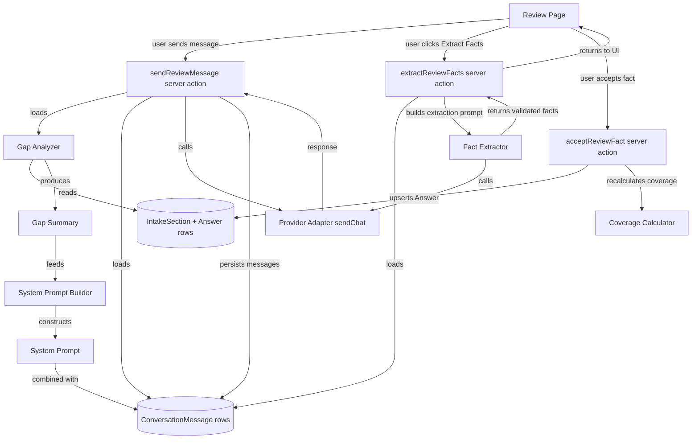

# Design Document: Chat Clarification (Review)

## Overview

This feature adds an AI-powered review conversation at `/projects/[id]/review` that analyzes the current intake state, identifies gaps across all eight sections, asks targeted follow-up questions, and extracts structured facts back into the canonical project model. The conversation persists across sessions and integrates with the existing completeness tracking.

### Key Design Decisions

1. **One session per project**: A `ConversationSession` has a unique constraint on `projectId`. Starting a new conversation replaces the old one conceptually, but we keep a single active session for simplicity.
2. **Full history sent to provider**: All messages are sent on each turn so the model has full context. When the history grows too long, older messages are summarized.
3. **Explicit fact extraction**: Facts are not auto-extracted. The user triggers "Extract Facts" and reviews each fact before it merges into the canonical model. This preserves the "user-confirmed > AI-inferred" hierarchy.
4. **Reuse of existing patterns**: Server actions follow the same `{ success, error? }` return shape. Facts are persisted as Answer rows with `source: "ai-conversation"`, reusing the existing accept/dismiss UI patterns.
5. **Gap analysis drives the system prompt**: The assistant's system prompt is rebuilt on each turn with the latest intake state, so it never asks for already-confirmed information.

## Architecture



### Data Flow Summary

1. User opens `/projects/[id]/review` → page loads existing messages or shows welcome state
2. User sends message → server action builds system prompt from gap analysis + history → calls provider → persists both messages → returns assistant response
3. User clicks "Extract Facts" → server action sends transcript with extraction prompt → AI returns JSON facts → validated and returned to UI
4. User reviews facts → accepts individual facts → server action upserts Answer rows with `source: "ai-conversation"` → coverage recalculated

## Components and Interfaces

### Review Page Route

**File**: `src/app/(workspace)/projects/[projectId]/review/page.tsx`

Server component that:
- Loads the project (404 if not found)
- Loads the active `ConversationSession` and its messages (if any)
- Loads all `IntakeSection` rows with coverage status for the sidebar
- Renders the `ReviewChat` client component and `CompletenessSidebar`

### ReviewChat Component

**File**: `src/features/review/components/review-chat.tsx`

Client component responsible for:
- Displaying conversation messages in chronological order
- Welcome state with "Start Conversation" button when no session exists
- Text input with send button
- Loading indicator while AI is processing
- Auto-scroll to latest message
- "Extract Facts" button (enabled after at least 2 message exchanges)
- Extracted facts review panel with Accept/Dismiss/Accept All actions
- Error display with retry capability

### Server Actions

#### `sendReviewMessage`

**File**: `src/features/review/actions/send-review-message.ts`

```typescript
interface SendReviewMessageInput {
  projectId: string;
  content: string;
}

interface SendReviewMessageResult {
  success: boolean;
  error?: string;
  assistantMessage?: string;
  sessionId?: string;
}
```

- Validates input
- Creates `ConversationSession` if none exists for the project
- Persists user message as `ConversationMessage`
- Loads all messages for the session
- Builds system prompt via `SystemPromptBuilder` (which uses `GapAnalyzer`)
- Calls `ProviderAdapter.sendChat`
- Persists assistant response as `ConversationMessage`
- Returns assistant message content

#### `extractReviewFacts`

**File**: `src/features/review/actions/extract-review-facts.ts`

```typescript
interface ExtractReviewFactsInput {
  projectId: string;
}

interface ExtractedFact {
  sectionKey: string;
  fieldKey: string;
  sectionName: string;
  fieldLabel: string;
  value: string;
}

interface ExtractReviewFactsResult {
  success: boolean;
  error?: string;
  facts?: ExtractedFact[];
}
```

- Loads the conversation transcript
- Builds an extraction prompt using `FactExtractor`
- Calls `ProviderAdapter.sendChat`
- Validates response against known section/field keys
- Enriches facts with display names (sectionName, fieldLabel)
- Returns validated facts for user review

#### `acceptReviewFact`

**File**: `src/features/review/actions/accept-review-fact.ts`

```typescript
interface AcceptReviewFactInput {
  projectId: string;
  sectionKey: string;
  fieldKey: string;
  value: string;
}
```

- Upserts Answer row with `source: "ai-conversation"`
- Recalculates coverage for the affected section
- Revalidates the review and intake paths
- Uses a transaction for atomicity

### Gap Analyzer Module

**File**: `src/features/review/lib/gap-analyzer.ts`

```typescript
interface GapSummary {
  missingRequired: { sectionKey: string; fieldKey: string; label: string; helpText: string }[];
  missingOptional: { sectionKey: string; fieldKey: string; label: string; helpText: string }[];
  confirmedAnswers: Record<string, Record<string, string>>;
  sectionStatuses: Record<string, string>;
}

function analyzeGaps(
  sections: IntakeSectionWithAnswers[],
): GapSummary
```

- Loads all IntakeSection and Answer records
- Identifies required fields with no answer or empty value
- Identifies optional fields in partial/unknown sections
- Collects confirmed answers (source "user-form" or "ai-conversation") as context
- Returns structured summary for the system prompt builder

### System Prompt Builder

**File**: `src/features/review/lib/system-prompt-builder.ts`

```typescript
function buildReviewSystemPrompt(
  gapSummary: GapSummary,
  projectName: string,
): string
```

- Constructs a system prompt that includes:
  - Role definition: review assistant for project intake
  - Current intake state summary (confirmed answers, missing fields)
  - Instructions to prioritize one question at a time
  - Instructions to explain why questions matter
  - Instructions to avoid re-asking confirmed information
  - Instructions to summarize learnings at milestones
  - Instructions to avoid inventing constraints
  - Valid section keys and field keys for fact mapping

### Fact Extractor Module

**File**: `src/features/review/lib/fact-extractor.ts`

```typescript
function buildFactExtractionPrompt(
  transcript: ChatMessage[],
): ChatMessage[]
```

- Builds a prompt instructing the AI to extract structured facts from the conversation
- Includes all valid section keys and field keys from `INTAKE_SECTIONS`
- Instructs JSON response format: `{ sectionKey: { fieldKey: value } }`
- Instructs to only extract explicitly stated or strongly implied facts

### Validation Schemas

**File**: `src/lib/validation/review.ts`

```typescript
const sendReviewMessageSchema = z.object({
  projectId: z.string().min(1),
  content: z.string().min(1).max(10000),
});

const extractReviewFactsSchema = z.object({
  projectId: z.string().min(1),
});

const acceptReviewFactSchema = z.object({
  projectId: z.string().min(1),
  sectionKey: sectionKeySchema,
  fieldKey: z.string().min(1),
  value: z.string().min(1),
});
```

## Data Models

### New Model: ConversationSession

```prisma
model ConversationSession {
  id        String   @id @default(cuid())
  projectId String   @unique
  project   Project  @relation(fields: [projectId], references: [id], onDelete: Cascade)
  createdAt DateTime @default(now())
  updatedAt DateTime @updatedAt

  messages ConversationMessage[]
}
```

### New Model: ConversationMessage

```prisma
model ConversationMessage {
  id        String              @id @default(cuid())
  sessionId String
  session   ConversationSession @relation(fields: [sessionId], references: [id], onDelete: Cascade)
  role      String              // "user" | "assistant"
  content   String
  createdAt DateTime            @default(now())

  @@index([sessionId])
}
```

### Project Model Changes

Add relation: `conversationSession ConversationSession?`

### Migration Strategy

Additive change. Use `npx prisma db push` per project rules.

### Entity Relationship

```mermaid
erDiagram
    Project ||--o| ConversationSession : "has"
    ConversationSession ||--o{ ConversationMessage : "has"
    Project ||--o{ IntakeSection : "has"
    IntakeSection ||--o{ Answer : "has"

    ConversationSession {
        string id PK
        string projectId FK UK
        datetime createdAt
        datetime updatedAt
    }

    ConversationMessage {
        string id PK
        string sessionId FK
        string role
        string content
        datetime createdAt
    }
```

## Correctness Properties

### Property 1: Gap analyzer identifies all missing required fields

*For any* set of IntakeSection and Answer records, the gap analyzer should list every required field from `INTAKE_SECTIONS` that has no Answer or an empty Answer value.

### Property 2: System prompt includes confirmed answers and missing fields

*For any* gap summary, the system prompt should contain every confirmed answer value and every missing field key, so the assistant has full context.

### Property 3: Fact extraction validates against known keys

*For any* AI response JSON, the fact extractor should retain only entries whose section key exists in `INTAKE_SECTIONS` and whose field key exists in that section's field definitions.

### Property 4: Accepted facts persist with correct source

*For any* accepted fact, the resulting Answer row should have `source: "ai-conversation"` and the coverage status should be recalculated for the affected section.

### Property 5: Message ordering is preserved

*For any* conversation session, messages returned to the UI should be in chronological `createdAt` order, and the full history sent to the provider should maintain this order.

## Error Handling

| Error Condition | Detection Point | User-Facing Behavior |
|---|---|---|
| No ProviderConnection configured | Server action, before AI call | Message with link to `/settings/provider` |
| Provider API error | `sendChat` catch block | Error in chat thread with retry button |
| Invalid extraction JSON | JSON.parse failure | Error message with retry button |
| Fact persistence failure | `acceptReviewFact` catch block | Error message, facts preserved for retry |
| Empty message submitted | Client-side validation | Send button disabled |

## Context Window Management

When the total message count exceeds a threshold (e.g., 40 messages), the server action should:
1. Keep the system prompt
2. Summarize older messages into a condensed summary message
3. Preserve the 5 most recent user+assistant pairs in full
4. Use the provider to generate the summary before the main call

This is a future optimization — for MVP, send all messages and let the provider handle truncation.

## Testing Strategy

### Unit Tests
- Gap analyzer: missing field identification, confirmed answer collection
- System prompt builder: prompt content verification
- Fact extractor: JSON validation, key filtering
- Validation schemas: valid/invalid inputs

### Property-Based Tests
- Property 1–5 as defined above

### Integration Tests
- `sendReviewMessage`: full flow with mocked provider
- `extractReviewFacts`: extraction with mocked provider
- `acceptReviewFact`: Answer persistence and coverage recalculation
