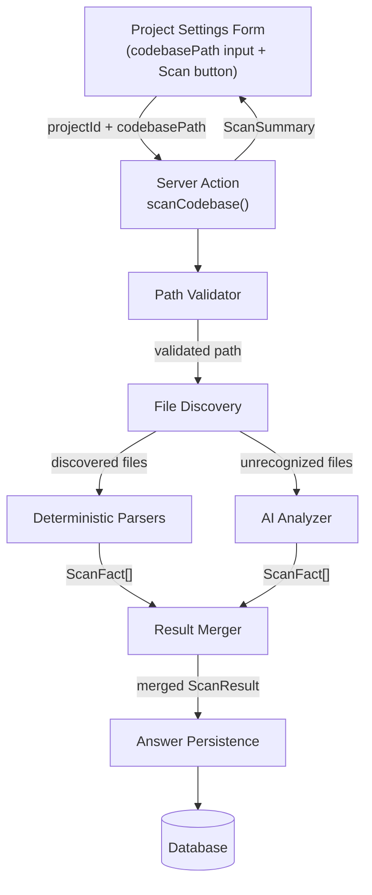

# Design Document: Codebase Scan Intake

## Overview

This feature adds a codebase scanning capability to Steering Studio's project settings flow. When a user selects "Extending existing project" as their project type, they can provide a local filesystem path to their codebase. The system scans the directory using two layers:

1. **Deterministic parsers** — structured extraction from well-known files (package.json, tsconfig.json, Prisma schema, Dockerfiles, CI/CD configs, README, directory structure, existing steering docs).
2. **AI-assisted analyzer** — sends unrecognized configuration files to the configured AI provider for interpretation.

Extracted facts are mapped to existing intake section fields and persisted as `Answer` records with distinct source tags (`"codebase-scan"` for deterministic, `"ai-codebase-scan"` for AI-derived). Users review, accept, or override all auto-detected values before document generation.

### Key Design Decisions

- **Server action architecture**: The scan is triggered via a Next.js server action, keeping all filesystem access and AI calls server-side. No filesystem paths or file content reach the client.
- **Two-layer extraction with deterministic precedence**: Deterministic parsers always win over AI results for the same field, ensuring predictable behavior for known file types.
- **Additive schema change**: A single nullable `codebasePath` column is added to the `Project` model — no migration reset needed.
- **Source tagging for traceability**: Each answer carries its origin (`"user-form"`, `"codebase-scan"`, `"ai-codebase-scan"`), enabling the UI to show provenance badges and ensuring user edits always take precedence.

## Architecture



### Module Placement

Following the existing feature-based structure:

```
src/features/codebase-scan/
  actions/
    scan-codebase.ts          # Server action entry point
  lib/
    validate-path.ts          # Path validation and security checks
    discover-files.ts         # File discovery with glob patterns
    parsers/
      package-json.ts         # package.json parser
      tsconfig.ts             # tsconfig.json / jsconfig.json parser
      prisma-schema.ts        # prisma/schema.prisma parser
      dockerfile.ts           # Dockerfile + docker-compose.yml parser
      ci-cd.ts                # GitHub Actions workflow parser
      readme.ts               # README.md parser
      directory-structure.ts  # Top-level + src/ directory analysis
      steering-docs.ts        # Existing .kiro/steering + copilot-instructions
    ai-analyzer.ts            # AI-assisted unrecognized file analysis
    merge-results.ts          # Merge deterministic + AI facts, deduplicate
    persist-scan.ts           # Save Answer records, recalculate coverage
    types.ts                  # ScanFact, ScanResult, ScanSummary types
  __tests__/                  # Unit and property tests
```

## Components and Interfaces

### 1. Path Validator (`validate-path.ts`)

Validates the codebase path before any file I/O.

```typescript
interface PathValidationResult {
  valid: boolean;
  resolvedPath: string;
  error?: string; // "Directory not found: [path]" | "Path is not a directory: [path]" | etc.
}

function validateCodebasePath(rawPath: string): Promise<PathValidationResult>;
```

Checks performed:
- Non-empty, absolute path
- Exists on filesystem
- Is a directory (not a file)
- Is readable by the process
- Does not resolve to a system root (`/`, `C:\`)
- Resolves symlinks and normalizes to prevent traversal

### 2. File Discovery (`discover-files.ts`)

Discovers known and unrecognized files within the validated path.

```typescript
interface DiscoveredFiles {
  known: Map<string, string>;       // relativePath → content (capped at 100KB)
  unrecognized: Map<string, string>; // relativePath → content (first 5KB, max 10 files)
  directoryListing: string[];        // top-level directory names
  srcSubdirs: string[];              // subdirectories under src/ (if exists)
}

function discoverFiles(resolvedPath: string): Promise<DiscoveredFiles>;
```

Known file checklist:
- `package.json`, `tsconfig.json`, `jsconfig.json`
- `prisma/schema.prisma`
- `Dockerfile`, `docker-compose.yml`
- `README.md`
- `.kiro/steering/*.md`
- `.github/copilot-instructions.md`
- `.github/workflows/*.yml` (max 5)

Unrecognized file detection:
- Scans root and recognized config directories for files not in the known list
- Matches patterns like `Cargo.toml`, `go.mod`, `build.gradle`, `pom.xml`, `Makefile`, `pyproject.toml`, `Gemfile`, `composer.json`, `angular.json`, `vue.config.js`, `nuxt.config.ts`, etc.
- Excludes files matching sensitive patterns (`.env`, `*.pem`, `*.key`, `*secret*`, `*credential*`)
- Caps at 10 unrecognized files, 5KB content each

### 3. Deterministic Parsers

Each parser implements a common interface:

```typescript
interface ScanFact {
  sectionKey: string;
  fieldKey: string;
  value: string;
  sourceFile: string;
  source: "codebase-scan" | "ai-codebase-scan";
}

type ParserFn = (content: string, fileName: string) => ScanFact[];
```

Parser registry:

| Parser | Input File(s) | Output Fields |
|--------|--------------|---------------|
| `package-json` | `package.json` | product-name, product-purpose, frameworks, testing-framework, programming-languages, coding-standards |
| `tsconfig` | `tsconfig.json` / `jsconfig.json` | programming-languages, coding-standards |
| `prisma-schema` | `prisma/schema.prisma` | database |
| `dockerfile` | `Dockerfile`, `docker-compose.yml` | hosting-deployment, database |
| `ci-cd` | `.github/workflows/*.yml` | source-control-platform, ci-cd-approach |
| `readme` | `README.md` | product-purpose (fallback) |
| `directory-structure` | directory listing | folder-structure, module-organization |
| `steering-docs` | `.kiro/steering/*.md`, `.github/copilot-instructions.md` | future-considerations |

### 4. AI Analyzer (`ai-analyzer.ts`)

Sends unrecognized files to the configured AI provider for interpretation.

```typescript
interface AiAnalyzerResult {
  facts: ScanFact[];
  error?: string; // populated on failure/timeout
}

function analyzeUnrecognizedFiles(
  files: Map<string, string>,
  providerConfig: ProviderConfig,
): Promise<AiAnalyzerResult>;
```

- Uses `resolveProvider("intake")` to get the configured provider
- Sends file names + truncated content (first 5KB per file, max 10 files)
- Prompts the AI to identify: languages, frameworks, libraries, build tools, test runners, databases, deployment targets
- Maps response to `ScanFact[]` with `source: "ai-codebase-scan"`
- Skips entirely if no provider is configured
- Catches errors/timeouts and returns partial result with warning

### 5. Result Merger (`merge-results.ts`)

Combines facts from all sources with precedence rules.

```typescript
interface ScanResult {
  facts: ScanFact[];
  filesScanned: string[];
  deterministicFieldCount: number;
  aiFieldCount: number;
  warnings: string[];
}

function mergeResults(
  deterministicFacts: ScanFact[],
  aiFacts: ScanFact[],
  filesScanned: string[],
  warnings: string[],
): ScanResult;
```

Merge rules:
- Group facts by `(sectionKey, fieldKey)`
- When multiple deterministic parsers produce values for the same field, concatenate with `, `
- Deterministic facts always take precedence over AI facts for the same field
- AI facts only fill fields not already covered by deterministic parsers

### 6. Answer Persistence (`persist-scan.ts`)

Saves scan results as `Answer` records.

```typescript
interface PersistResult {
  fieldsCreated: number;
  fieldsUpdated: number;
  fieldsSkipped: number; // skipped because user-form answer exists
}

function persistScanResults(
  projectId: string,
  scanResult: ScanResult,
): Promise<PersistResult>;
```

Persistence rules:
- For each fact, look up the `IntakeSection` by `(projectId, sectionKey)`
- Check existing `Answer` for `(intakeSectionId, fieldKey)`
  - If source is `"user-form"` → skip (preserve user input)
  - If source is `"codebase-scan"` or `"ai-codebase-scan"` → overwrite
  - If no answer exists → create
- After all upserts, recalculate `coverageStatus` for each affected section

### 7. Server Action (`scan-codebase.ts`)

Orchestrates the full scan pipeline.

```typescript
interface ScanSummary {
  success: boolean;
  filesScanned: number;
  deterministicFieldCount: number;
  aiFieldCount: number;
  warnings: string[];
  error?: string;
}

async function scanCodebase(projectId: string): Promise<ScanSummary>;
```

Flow:
1. Load project from DB, read `codebasePath`
2. Validate path
3. Discover files
4. Run deterministic parsers on known files
5. Run AI analyzer on unrecognized files (if provider available)
6. Merge results
7. Persist answers
8. Return summary

### 8. UI Changes (`project-settings-form.tsx`)

Additions to the existing form:
- **Codebase path input**: Text field shown only when `projectType === "extension"`. Bound to a new `codebasePath` field on the update schema.
- **Scan button**: Shown when a valid `codebasePath` is saved. Triggers the `scanCodebase` server action.
- **Scan status**: Loading indicator during scan, summary display on completion, error display on failure.

Intake form changes:
- **Source badges**: Fields with `source: "codebase-scan"` show an "Auto-detected" badge. Fields with `source: "ai-codebase-scan"` show an "AI-detected" badge.
- **Edit behavior**: When a user edits a scan-sourced field, the source updates to `"user-form"` on save (existing `saveAnswer` action already sets `source: "user-form"`).

## Data Models

### Schema Change

Add a nullable `codebasePath` column to the `Project` model:

```prisma
model Project {
  // ... existing fields ...
  codebasePath    String?  // absolute filesystem path to codebase root
}
```

Applied via `npx prisma db push` (additive, nullable — no data loss).

### ScanFact Type

```typescript
interface ScanFact {
  sectionKey: string;
  fieldKey: string;
  value: string;
  sourceFile: string;
  source: "codebase-scan" | "ai-codebase-scan";
}
```

### ScanResult Type

```typescript
interface ScanResult {
  facts: ScanFact[];
  filesScanned: string[];
  deterministicFieldCount: number;
  aiFieldCount: number;
  warnings: string[];
}
```

### ScanSummary Type (returned to UI)

```typescript
interface ScanSummary {
  success: boolean;
  filesScanned: number;
  deterministicFieldCount: number;
  aiFieldCount: number;
  warnings: string[];
  error?: string;
}
```

### Answer Source Values

The existing `Answer.source` field (string) gains two new valid values:
- `"codebase-scan"` — from deterministic parsers
- `"ai-codebase-scan"` — from AI analyzer

No schema change needed; validated at the application layer.

### Validation Schema Updates

```typescript
// In src/lib/validation/project.ts
export const updateProjectSettingsSchema = z.object({
  // ... existing fields ...
  codebasePath: z.string().optional(),
});

// New schema for scan action
export const scanCodebaseSchema = z.object({
  projectId: z.string().min(1),
});
```


## Correctness Properties

*A property is a characteristic or behavior that should hold true across all valid executions of a system — essentially, a formal statement about what the system should do. Properties serve as the bridge between human-readable specifications and machine-verifiable correctness guarantees.*

### Property 1: Path validation rejects invalid paths

*For any* string input to `validateCodebasePath`, the result should be `valid: true` only when the input is a non-empty absolute path that exists on the filesystem, points to a directory (not a file), is readable, and does not resolve to a system root. All other inputs should produce `valid: false` with an appropriate error message.

**Validates: Requirements 1.3, 2.1, 2.2, 2.3, 2.4, 2.5**

### Property 2: File discovery finds exactly the known files that exist

*For any* directory structure under a valid codebase path, `discoverFiles` should return in `known` exactly those files from the known file checklist that exist and are readable, and in `unrecognized` only configuration/documentation files at the root or recognized config directories that do not match any known file pattern. Missing known files should not cause errors.

**Validates: Requirements 3.1, 3.2, 3.3, 3.4, 3.6**

### Property 3: File read size limits are enforced

*For any* file read during scanning, known file content should be truncated to at most 100 KB, README content to at most 10 KB, workflow files to at most 5, and unrecognized files to at most 10 files with 5 KB content each.

**Validates: Requirements 3.5, 7.3, 9.2, 12.1**

### Property 4: package.json parser extracts correct fields

*For any* valid package.json object, the parser should: extract `name` to `product-and-users/product-name`, extract `description` to `product-and-users/product-purpose`, identify known frameworks from dependencies/devDependencies and map to `tech-stack-and-architecture/frameworks`, identify known test runners and map to `testing-and-quality/testing-framework`, identify known build tools and map to `tech-stack-and-architecture/coding-standards`, identify known ORMs and map to `tech-stack-and-architecture/database`, and include "TypeScript" in `tech-stack-and-architecture/programming-languages` when typescript is a dependency. Only recognized packages should appear in the output; unknown packages should be ignored.

**Validates: Requirements 4.1, 4.2, 4.3, 4.4, 4.5, 4.6, 6.3**

### Property 5: TypeScript config parser extracts language and path aliases

*For any* valid tsconfig.json (or jsconfig.json as fallback), the parser should add "TypeScript" to `tech-stack-and-architecture/programming-languages` and, when `compilerOptions.paths` entries exist, include path alias information in `project-structure-and-conventions/coding-standards`.

**Validates: Requirements 5.1, 5.2, 5.3**

### Property 6: Prisma schema parser extracts database provider and ORM

*For any* valid Prisma schema file containing a `datasource` block, the parser should extract the provider value and include "Prisma" as the ORM, mapping both to `tech-stack-and-architecture/database`.

**Validates: Requirements 6.1, 6.2**

### Property 7: CI/CD parser extracts platform and workflow summary

*For any* set of valid GitHub Actions workflow YAML files, the parser should set `workflows-and-team-practices/source-control-platform` to "GitHub" and extract workflow names and trigger events into `workflows-and-team-practices/ci-cd-approach`.

**Validates: Requirements 7.1, 7.2**

### Property 8: Docker parser extracts deployment and database info

*For any* Dockerfile and/or docker-compose.yml, the parser should include "Docker" and/or "Docker Compose" in `tech-stack-and-architecture/hosting-deployment`, and when docker-compose.yml contains service definitions with known database images (postgres, mysql, redis, mongo), include those database names in `tech-stack-and-architecture/database`.

**Validates: Requirements 8.1, 8.2, 8.3**

### Property 9: Directory structure analysis detects organization patterns

*For any* set of top-level directory names and src/ subdirectories, the parser should produce a `folder-structure` value and correctly classify `module-organization` as "Feature-based (grouped by domain)" when `src/features` exists, or "Layer-based (grouped by type)" when layer-based directories (controllers, services, models) exist.

**Validates: Requirements 10.1, 10.2, 10.3, 10.4**

### Property 10: Sensitive file exclusion

*For any* set of files discovered during scanning, files matching sensitive patterns (`.env`, `.env.*`, `*.pem`, `*.key`, `*secret*`, `*credential*`) should never appear in the discovered files output and should never be sent to the AI analyzer.

**Validates: Requirements 12.8, 17.4**

### Property 11: All file reads stay within the codebase directory

*For any* file path resolved during scanning, the resolved absolute path must be a descendant of the validated codebase root directory. Symbolic links resolving outside the codebase directory must not be followed.

**Validates: Requirements 17.1, 17.3**

### Property 12: Deterministic facts take precedence over AI facts

*For any* set of deterministic facts and AI facts where both produce a value for the same `(sectionKey, fieldKey)` pair, the merged result should contain only the deterministic value for that field.

**Validates: Requirements 12.7**

### Property 13: Merge produces exactly one value per field

*For any* set of `ScanFact` objects from all sources, the merged `ScanResult` should contain at most one entry per unique `(sectionKey, fieldKey)` pair, and every fact should reference a valid sectionKey/fieldKey from the intake section configuration with a non-empty sourceFile.

**Validates: Requirements 13.1, 13.2, 13.3**

### Property 14: ScanResult JSON round-trip

*For any* valid `ScanResult` object, serializing to JSON and deserializing back should produce an equivalent object.

**Validates: Requirements 13.4**

### Property 15: Persistence respects answer source precedence

*For any* scan result and existing answer state, persisting scan results should: skip fields where the existing answer has source `"user-form"`, overwrite fields where the existing answer has source `"codebase-scan"` or `"ai-codebase-scan"`, create new answers for fields with no existing answer, tag deterministic facts with source `"codebase-scan"` and AI facts with source `"ai-codebase-scan"`, and recalculate `coverageStatus` for each affected intake section.

**Validates: Requirements 14.1, 14.2, 14.3, 14.4, 12.4**

## Error Handling

### Path Validation Errors

| Condition | Error Message | Recovery |
|-----------|--------------|----------|
| Path does not exist | "Directory not found: [path]" | User corrects path |
| Path is a file | "Path is not a directory: [path]" | User corrects path |
| Path not readable | "Cannot read directory: [path]" | User fixes permissions |
| Path is system root | "Cannot scan a system root directory" | User provides project path |
| Empty/relative path | "Please enter an absolute filesystem path" | User corrects input |

### File Read Errors

- Individual file read failures (permissions, encoding) are logged and skipped — the scan continues with remaining files.
- Files exceeding size limits are truncated, not skipped.

### AI Analyzer Errors

- No provider configured → AI analysis skipped silently, scan proceeds with deterministic results only.
- Provider call fails or times out → Error logged, warning added to `ScanSummary.warnings`, scan proceeds with deterministic results.
- AI returns unparseable response → Treated as failure, warning added, deterministic results used.

### Scan-Level Errors

- Zero facts extracted → Success with message "No recognizable project files found at the specified path."
- Database persistence failure → Error returned to UI, user can retry.

## Testing Strategy

### Property-Based Testing

Use `fast-check` (already available in the project via vitest) for property-based tests. Each property test should run a minimum of 100 iterations.

Tests should be colocated at `src/features/codebase-scan/__tests__/`.

Each property test must be tagged with a comment referencing the design property:
```
// Feature: codebase-scan-intake, Property N: [property title]
```

Key property tests:

1. **Path validation** — Generate random strings (absolute paths, relative paths, empty strings, root paths) and verify validation correctness.
2. **package.json parser** — Generate random package.json objects with varying dependency sets and verify correct field extraction.
3. **Merge precedence** — Generate random sets of deterministic and AI facts with overlapping fields and verify deterministic always wins.
4. **ScanResult round-trip** — Generate random ScanResult objects and verify JSON serialization round-trip.
5. **Persistence precedence** — Generate random existing answer states and scan facts, verify user-form answers are never overwritten.
6. **Sensitive file exclusion** — Generate random filenames including sensitive patterns and verify they are always filtered out.
7. **File containment** — Generate random file paths with traversal attempts and verify all resolved paths stay within the codebase root.
8. **Merge deduplication** — Generate random fact sets with duplicate keys and verify exactly one value per field in output.

### Unit Tests

Specific examples and edge cases:

- Each deterministic parser with realistic fixture files (real package.json, tsconfig.json, Prisma schema, etc.)
- Path validation with specific edge cases (Windows drive roots, Unix root, symlinks)
- README parser with various markdown structures
- Directory structure analysis with known patterns
- AI analyzer prompt construction verification
- Coverage recalculation after scan persistence

### Integration Tests

- Full scan pipeline with a temporary directory containing known files → verify correct Answer records in DB
- Re-scan with existing user-form answers → verify they are preserved
- Scan with no AI provider configured → verify graceful degradation

### Test Configuration

- Property-based testing library: `fast-check`
- Minimum iterations per property: 100
- Each property test references its design document property number
- Tag format: `Feature: codebase-scan-intake, Property {number}: {property_text}`
