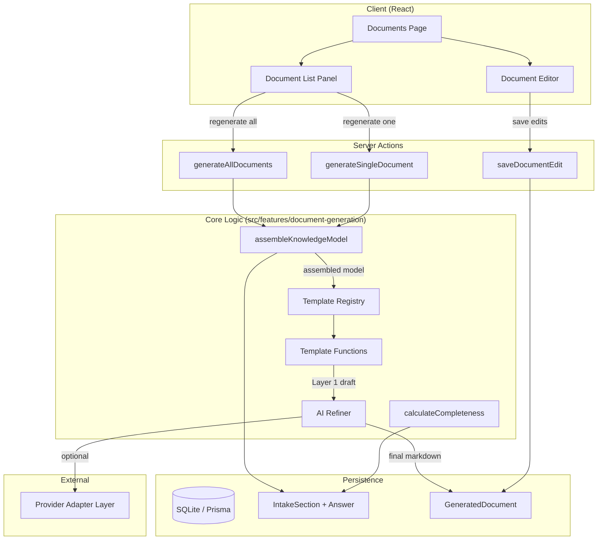

# Design Document: Document Generation

## Overview

The Document Generation feature transforms the canonical project knowledge model into target-specific markdown steering documents. It follows a two-layer architecture: Layer 1 uses deterministic TypeScript template functions to assemble structured markdown from intake answers and review facts; Layer 2 optionally refines the output through the existing provider adapter layer for improved clarity.

The feature lives at `/projects/[projectId]/documents` and integrates into the existing workspace layout. Users can preview, edit, regenerate (all or single), and persist documents. An overwrite protection mechanism warns before replacing manually edited content.

### Key Design Decisions

1. **Templates as pure functions**: Each template is a TypeScript function that receives a typed `KnowledgeModel` and returns a markdown string. This keeps rendering deterministic, testable, and debuggable.
2. **Knowledge model assembly at generation time**: Rather than maintaining a separate knowledge model table, the system assembles the model on-demand by querying `IntakeSection`/`Answer` rows and accepted review facts. This avoids data duplication and keeps the model always current.
3. **Upsert-based persistence**: Documents are upserted by `(projectId, filePath)` composite key, so regeneration updates existing records rather than creating duplicates.
4. **AI refinement is opt-in and fallback-safe**: If the provider is unavailable, the Layer 1 draft is used as-is with a warning surfaced to the user.

## Architecture



### Data Flow

1. User triggers generation (all or single) via server action
2. `assembleKnowledgeModel` queries all `IntakeSection` + `Answer` rows for the project, plus accepted review facts
3. The `TemplateRegistry` determines which templates apply based on the project's `targetOutput`
4. Each template function receives the typed `KnowledgeModel` and returns `{ markdown: string, completeness: CompletenessStatus }`
5. If AI refinement is enabled and a provider is configured, the `AIRefiner` sends the Layer 1 draft through `sendChat` for polishing
6. Both the pre-refinement draft and final content are persisted to `GeneratedDocument`
7. The client revalidates and displays the updated document list

## Components and Interfaces

### Server Actions (`src/features/document-generation/actions/`)

```typescript
// generate-documents.ts
"use server"
async function generateAllDocuments(projectId: string): Promise<GenerateResult>

// generate-single-document.ts
"use server"
async function generateSingleDocument(
  projectId: string,
  filePath: string
): Promise<GenerateResult>

// save-document-edit.ts
"use server"
async function saveDocumentEdit(
  documentId: string,
  content: string
): Promise<void>
```

### Knowledge Model Assembly (`src/features/document-generation/lib/`)

```typescript
// assemble-knowledge-model.ts
interface KnowledgeModel {
  productName: string;
  productPurpose: string;
  targetUsers: string;
  primaryUseCases: string;
  problemStatement: string;
  desiredOutcomes: string;
  successMetrics: string;
  keyValueProposition: string;
  inScopeFeatures: string;
  nonGoals: string;
  mvpBoundaries: string;
  futureConsiderations: string;
  programmingLanguages: string;
  frameworks: string;
  database: string;
  hostingDeployment: string;
  architecturePattern: string;
  folderStructure: string;
  namingConventions: string;
  moduleOrganization: string;
  codingStandards: string;
  testingFramework: string;
  testTypes: string;
  coverageExpectations: string;
  qualityGates: string;
  authenticationMethod: string;
  authorizationModel: string;
  dataSensitivity: string;
  complianceRequirements: string;
  branchingStrategy: string;
  sourceControlPlatform: string;
  ciCdApproach: string;
  codeReviewProcess: string;
  deploymentWorkflow: string;
}

function assembleKnowledgeModel(projectId: string): Promise<KnowledgeModel>
```

This function queries all `IntakeSection` rows with their `Answer` children for the given project, then maps each `(sectionKey, fieldKey)` pair to the corresponding `KnowledgeModel` property. Missing answers result in empty strings.

### Template Registry (`src/features/document-generation/lib/`)

```typescript
// template-registry.ts
type TargetOutput = "Kiro" | "Copilot" | "Both";

interface TemplateDefinition {
  templateId: string;
  filePath: string;           // e.g. ".kiro/steering/product.md"
  target: "kiro" | "copilot"; // which target this template belongs to
  required: boolean;          // required vs optional for the target
  render: TemplateFn;
  isApplicable: (model: KnowledgeModel) => boolean;
}

interface TemplateResult {
  markdown: string;
  completeness: CompletenessStatus;
  missingFields: string[];
}

type TemplateFn = (model: KnowledgeModel) => TemplateResult;

function getTemplatesForTarget(target: TargetOutput): TemplateDefinition[]
```

The registry returns all applicable templates for a given target. For "Both", it returns the union of Kiro and Copilot templates. Each template has an `isApplicable` guard that checks whether the knowledge model has enough data to produce meaningful output (used for optional templates like `testing.md`).

### Template Functions (`src/features/document-generation/templates/`)

Each template is a pure function:

```typescript
// kiro/product.template.ts
export function renderProductMd(model: KnowledgeModel): TemplateResult

// kiro/tech.template.ts
export function renderTechMd(model: KnowledgeModel): TemplateResult

// kiro/structure.template.ts
export function renderStructureMd(model: KnowledgeModel): TemplateResult

// kiro/testing.template.ts (optional)
export function renderTestingMd(model: KnowledgeModel): TemplateResult

// kiro/security.template.ts (optional)
export function renderSecurityMd(model: KnowledgeModel): TemplateResult

// kiro/workflows.template.ts (optional)
export function renderWorkflowsMd(model: KnowledgeModel): TemplateResult

// copilot/copilot-instructions.template.ts
export function renderCopilotInstructionsMd(model: KnowledgeModel): TemplateResult

// shared/agents.template.ts (optional)
export function renderAgentsMd(model: KnowledgeModel): TemplateResult
```

Each template function:
- Receives the full `KnowledgeModel`
- Checks which fields it needs and tracks missing ones
- Assembles markdown using string concatenation (no external templating engine needed for structured data)
- Returns `{ markdown, completeness, missingFields }`

### AI Refiner (`src/features/document-generation/lib/`)

```typescript
// ai-refiner.ts
interface RefineResult {
  refined: string;
  wasRefined: boolean;
  error?: string;
}

async function refineDocument(
  draft: string,
  providerConfig: ProviderConfig
): Promise<RefineResult>
```

Uses the existing `sendChat` method from the provider adapter layer. The system prompt instructs the model to improve clarity and remove repetition without altering facts. If the provider call fails, returns `{ refined: draft, wasRefined: false, error: "..." }`.

### Completeness Calculator (`src/features/document-generation/lib/`)

```typescript
// calculate-completeness.ts
type CompletenessStatus = "complete" | "partial" | "empty";

function calculateDocumentCompleteness(
  requiredFields: string[],
  model: KnowledgeModel
): { status: CompletenessStatus; missingFields: string[] }
```

### React Components (`src/features/document-generation/components/`)

```typescript
// document-list-panel.tsx
// Displays list of generated documents with completeness indicators,
// timestamps, file paths, and regenerate actions.

// document-preview.tsx
// Renders the selected document's markdown content in a read-only preview.

// document-editor.tsx
// Provides an editable textarea for modifying document content,
// with save and cancel actions.

// overwrite-warning-dialog.tsx
// Confirmation dialog shown before regeneration overwrites manually edited documents.

// completeness-summary.tsx
// Displays summary counts of complete, partial, and empty documents.

// generation-empty-state.tsx
// Shown when no documents have been generated yet, with guidance to trigger generation.
```

### Page Component (`src/app/(workspace)/projects/[projectId]/documents/page.tsx`)

The documents page composes the above components in a two-column layout:
- Left: `DocumentListPanel` with completeness summary
- Right: `DocumentPreview` or `DocumentEditor` depending on mode

## Data Models

### New Prisma Model: `GeneratedDocument`

```prisma
model GeneratedDocument {
  id                String   @id @default(cuid())
  projectId         String
  project           Project  @relation(fields: [projectId], references: [id], onDelete: Cascade)
  filePath          String   // e.g. ".kiro/steering/product.md"
  content           String   // final markdown content (post-refinement if applied)
  draftContent      String   // Layer 1 template-rendered content (pre-refinement)
  completeness      String   // "complete" | "partial" | "empty"
  missingFields     String   @default("[]") // JSON array of missing field names
  templateVersion   String   @default("1.0")
  manuallyEdited    Boolean  @default(false)
  generatedAt       DateTime @default(now())
  updatedAt         DateTime @updatedAt

  @@unique([projectId, filePath])
}
```

The `Project` model needs a new relation field:

```prisma
// Add to existing Project model:
generatedDocuments  GeneratedDocument[]
```

### Zod Validation Schemas (`src/lib/validation/generated-document.ts`)

```typescript
import { z } from "zod";

export const completenessStatusSchema = z.enum(["complete", "partial", "empty"]);
export type CompletenessStatus = z.infer<typeof completenessStatusSchema>;

export const saveDocumentEditSchema = z.object({
  documentId: z.string().min(1),
  content: z.string(),
});

export const generateDocumentsSchema = z.object({
  projectId: z.string().min(1),
});

export const generateSingleDocumentSchema = z.object({
  projectId: z.string().min(1),
  filePath: z.string().min(1),
});
```


## Correctness Properties

*A property is a characteristic or behavior that should hold true across all valid executions of a system — essentially, a formal statement about what the system should do. Properties serve as the bridge between human-readable specifications and machine-verifiable correctness guarantees.*

### Property 1: Knowledge model assembly preserves all confirmed answers

*For any* project with a set of intake answers, assembling the knowledge model should produce an object where every non-empty answer value appears in the corresponding knowledge model field, and no confirmed answer is dropped or altered.

**Validates: Requirements 1.1**

### Property 2: Deterministic template rendering produces valid markdown

*For any* knowledge model where all required fields for a template are non-empty, the template render function should return a non-empty markdown string with `completeness` equal to `"complete"`.

**Validates: Requirements 1.2**

### Property 3: Missing optional fields are omitted, never placeholders

*For any* knowledge model with one or more empty optional fields, the rendered markdown should not contain placeholder patterns (e.g., `[TODO]`, `[PLACEHOLDER]`, `TBD`, `N/A`) in place of the missing data. The corresponding sections should be absent from the output entirely.

**Validates: Requirements 1.3**

### Property 4: User terminology is preserved verbatim

*For any* knowledge model field that contains a non-empty value, the rendered markdown output from the corresponding template should contain that exact string as a substring.

**Validates: Requirements 1.4**

### Property 5: Completeness status invariant

*For any* generated document, the `completeness` field is one of `"complete"`, `"partial"`, or `"empty"`. If `completeness` is `"partial"`, then `missingFields` is a non-empty array. If `completeness` is `"complete"`, then `missingFields` is empty. If `completeness` is `"empty"`, then the markdown content contains only structural headings or is minimal.

**Validates: Requirements 1.5, 10.1, 10.2**

### Property 6: "Both" target is a superset of individual targets

*For any* call to `getTemplatesForTarget("Both")`, the returned template set should contain every template returned by `getTemplatesForTarget("Kiro")` and every template returned by `getTemplatesForTarget("Copilot")`, identified by `filePath`.

**Validates: Requirements 2.3**

### Property 7: Optional template applicability

*For any* optional template definition and any knowledge model, the template is included in the generation output if and only if `isApplicable(model)` returns true. When the knowledge model has sufficient data for the template's domain (e.g., testing fields are non-empty), `isApplicable` returns true; when those fields are all empty, it returns false.

**Validates: Requirements 2.4, 2.5, 2.6, 2.7**

### Property 8: Draft content is always stored

*For any* generated document record, the `draftContent` field is non-empty and represents the Layer 1 template-rendered output. If AI refinement was applied, `content` may differ from `draftContent`; if refinement was not applied or failed, `content` equals `draftContent`.

**Validates: Requirements 3.1, 3.4, 9.4**

### Property 9: Manual edit flag state machine

*For any* document, immediately after generation (or regeneration), `manuallyEdited` is `false`. After a `saveDocumentEdit` call, `manuallyEdited` is `true`. After a subsequent regeneration of that document, `manuallyEdited` is reset to `false`.

**Validates: Requirements 5.3, 8.1, 8.3**

### Property 10: Overwrite warning is shown if and only if edited documents exist in scope

*For any* set of documents in the regeneration scope, the system requires user confirmation if and only if at least one document has `manuallyEdited === true`. The set of documents identified in the warning should be exactly those where `manuallyEdited === true`.

**Validates: Requirements 6.2, 7.2, 8.2, 8.4**

### Property 11: Regenerate-all updates every document in the target set

*For any* project, after a "regenerate all" operation, every document in the target-specific template set should have a `generatedAt` timestamp equal to or later than the operation start time, and its content should reflect the current knowledge model.

**Validates: Requirements 6.1, 6.5**

### Property 12: Single-document regeneration isolation

*For any* project with multiple generated documents, regenerating a single document by `filePath` should update only that document's `content`, `draftContent`, and `generatedAt` fields. All other documents should remain byte-for-byte identical.

**Validates: Requirements 7.1, 7.3, 7.4**

### Property 13: Regeneration is idempotent on document count

*For any* project, running document generation N times (where N >= 1) should result in the same number of `GeneratedDocument` records as running it once, given the same knowledge model and target output. The `(projectId, filePath)` uniqueness constraint ensures upsert behavior.

**Validates: Requirements 9.3**

### Property 14: Persisted documents have all required fields

*For any* `GeneratedDocument` record in the database, the following fields are non-null and non-empty: `projectId`, `filePath`, `content`, `draftContent`, `completeness`, `templateVersion`, and `generatedAt`.

**Validates: Requirements 9.1**

### Property 15: Summary counts are consistent

*For any* list of generated documents for a project, the sum of documents with `completeness === "complete"`, `completeness === "partial"`, and `completeness === "empty"` should equal the total document count.

**Validates: Requirements 10.4**

## Error Handling

### AI Provider Errors

- If the provider is not configured or the connection fails during refinement, the system falls back to the Layer 1 template draft as the final content.
- A warning message is returned in the `GenerateResult` indicating refinement was skipped and why.
- The `draftContent` and `content` fields will be identical in this case.

### Missing Knowledge Model Data

- Templates gracefully handle missing fields by omitting sections rather than crashing.
- The `completeness` field and `missingFields` array communicate gaps to the user.
- Generation proceeds even with incomplete data — the user can fill gaps and regenerate.

### Database Errors

- Server actions catch Prisma errors and return structured error responses.
- Unique constraint violations on `(projectId, filePath)` are handled by upsert logic, not caught as errors.

### Validation Errors

- All server action inputs are validated with Zod schemas before processing.
- Invalid inputs return descriptive error messages without exposing internal details.

### Concurrent Regeneration

- The MVP does not implement optimistic locking. If the user triggers regeneration while another is in progress, the last write wins.
- Future enhancement: add a `generationStatus` field to prevent concurrent generation.

## Testing Strategy

### Unit Tests

Focus on pure functions that form the core of the generation pipeline:

- **Template functions**: Each template function tested with various knowledge model states (complete, partial, empty). Verify markdown structure, section presence/absence, and terminology preservation.
- **Knowledge model assembly**: Test mapping from intake answers to knowledge model fields. Verify all field mappings are correct.
- **Completeness calculation**: Test the three-state completeness logic with various field combinations.
- **Template registry**: Test `getTemplatesForTarget` returns correct templates for each target type.
- **Overwrite warning logic**: Test the function that determines whether confirmation is needed based on `manuallyEdited` flags.

### Property-Based Tests

Use `fast-check` as the property-based testing library. Each property test runs a minimum of 100 iterations.

Property tests should be colocated with the module they test under `__tests__/` directories:

- `src/features/document-generation/lib/__tests__/assemble-knowledge-model.pbt.test.ts`
- `src/features/document-generation/lib/__tests__/calculate-completeness.pbt.test.ts`
- `src/features/document-generation/lib/__tests__/template-registry.pbt.test.ts`
- `src/features/document-generation/templates/__tests__/templates.pbt.test.ts`

Each property-based test must be tagged with a comment referencing the design property:

```typescript
// Feature: document-generation, Property 4: User terminology is preserved verbatim
```

Each correctness property from this design document must be implemented by a single property-based test. Generators should produce random `KnowledgeModel` instances with varying field completeness.

### Golden-File Tests

Located under `tests/golden/`:

- Compare rendered markdown output against known-good fixtures for stable knowledge model inputs.
- Verify heading structure, section ordering, and file path correctness.
- Golden files should be updated intentionally when templates change.

### Integration Tests

Located under `tests/integration/`:

- **Generate documents action**: Test the full server action flow with a seeded database, verifying documents are persisted correctly.
- **Save document edit action**: Test that edits are persisted and `manuallyEdited` is set.
- **Regeneration with overwrite**: Test the regeneration flow with and without manually edited documents.

### E2E Tests

Located under `tests/e2e/`:

- Navigate to documents page, trigger generation, verify document list appears.
- Select a document, verify preview content.
- Edit a document, save, verify persistence.
- Regenerate with edited documents, verify overwrite warning appears.
