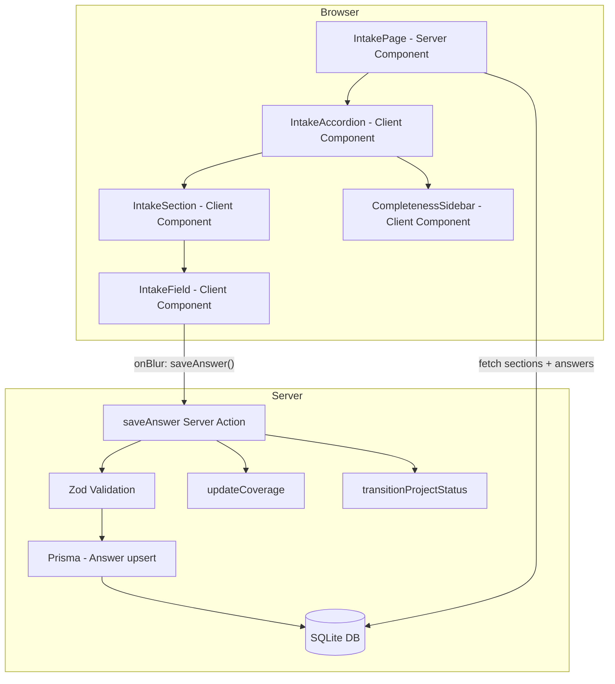

# Guided Intake — Design Document

## Overview

The guided intake feature provides a structured, section-based form experience at `/projects/[projectId]/intake` where users supply project context that drives downstream document generation. The intake page presents eight thematic sections with progressive disclosure (one section expanded at a time), tracks completeness per section via a sidebar, and persists all answers to a canonical model through server actions with Zod validation.

The design follows the existing feature-module pattern: a `src/features/intake` module owns the UI components, server actions, section configuration, and completeness logic. The route page at `src/app/(workspace)/projects/[projectId]/intake/page.tsx` is a thin server component that fetches data and delegates rendering to feature components.

### Key Design Decisions

1. **Section definitions in code, not in the database** — The eight sections and their fields are defined as a typed configuration object (`INTAKE_SECTIONS`). The database `IntakeSection` rows are created per-project to track coverage status, but the field definitions themselves live in code. This keeps the schema stable and avoids a complex admin UI for the MVP.

2. **Auto-save on blur** — Answers persist when a field loses focus, using a server action. This avoids explicit "Save" buttons and matches the progressive, low-friction UX goal.

3. **Accordion pattern for progressive disclosure** — Only one section is expanded at a time. Clicking a collapsed section header expands it and collapses the previous one. This is implemented as client-side state in a single `IntakeAccordion` component.

4. **Coverage computed from answers** — Section coverage (`unknown` | `partial` | `complete`) is derived by comparing persisted answers against the required fields defined in the section config. A pure function `calculateCoverage` handles this, making it easy to test.

5. **Source attribution on answers** — Each `Answer` row stores a `source` field (`user-form`, `ai-inferred`, `ai-conversation`) so the canonical model knows where every fact came from. User-form values always override AI-inferred values for the same field.

## Architecture



### Data Flow

1. **Page load**: The server component fetches the project, its `IntakeSection` rows (creating them if missing), and all `Answer` rows. It passes this data as props to the client accordion.
2. **User interaction**: The user fills in fields. On blur, the client calls the `saveAnswer` server action with `projectId`, `sectionKey`, `fieldKey`, and `value`.
3. **Persistence**: The server action validates with Zod, upserts the `Answer` row, recalculates section coverage, and updates the `IntakeSection.coverageStatus`. If this is the first answer and the project status is `setup`, it transitions to `intake`.
4. **UI update**: The server action calls `revalidatePath` to refresh the page data. The sidebar reflects the updated coverage.

### Module Boundaries

| Module | Responsibility |
|---|---|
| `src/features/intake/config/` | Section and field definitions (typed config) |
| `src/features/intake/actions/` | `saveAnswer`, `initIntakeSections` server actions |
| `src/features/intake/components/` | `IntakeAccordion`, `IntakeSection`, `IntakeField`, `CompletenessSidebar`, field-status badge |
| `src/features/intake/lib/` | `calculateCoverage` pure function |
| `src/lib/validation/intake.ts` | Zod schemas for intake mutations |
| `src/app/(workspace)/projects/[projectId]/intake/page.tsx` | Route page (thin server component) |

## Components and Interfaces

### Section Configuration (`src/features/intake/config/sections.ts`)

```typescript
export type FieldType = "short-text" | "long-text" | "single-select" | "multi-select" | "tag-list";
export type FieldStatus = "required" | "optional";

export interface IntakeFieldDef {
  fieldKey: string;
  label: string;
  type: FieldType;
  status: FieldStatus;
  helpText: string;
  placeholder?: string;
  options?: string[];  // for single-select, multi-select
}

export interface IntakeSectionDef {
  sectionKey: string;
  displayName: string;
  description: string;
  sortOrder: number;
  fields: IntakeFieldDef[];
}

export const INTAKE_SECTIONS: IntakeSectionDef[] = [
  // 8 sections defined here
];
```

### Server Action: `saveAnswer`

```typescript
// src/features/intake/actions/save-answer.ts
"use server";

export interface SaveAnswerInput {
  projectId: string;
  sectionKey: string;
  fieldKey: string;
  value: string;
}

export interface SaveAnswerResult {
  success: boolean;
  error?: string;
  coverageStatus?: string;
}

export async function saveAnswer(input: SaveAnswerInput): Promise<SaveAnswerResult>;
```

**Behavior:**
1. Validate input with `saveAnswerSchema`.
2. Look up the `IntakeSection` by `(projectId, sectionKey)`.
3. Upsert the `Answer` row by `(intakeSectionId, fieldKey)` with `source: "user-form"`.
4. Recalculate coverage for the section.
5. Update `IntakeSection.coverageStatus`.
6. If project status is `setup`, transition to `intake`.
7. Call `revalidatePath`.

### Server Action: `initIntakeSections`

```typescript
// src/features/intake/actions/init-intake-sections.ts
"use server";

export async function initIntakeSections(projectId: string): Promise<void>;
```

Creates the eight `IntakeSection` rows for a project if they don't already exist. Called from the intake page server component on load.

### Client Components

**`IntakeAccordion`** — Manages which section is expanded. Receives section definitions, section DB rows (for coverage), and answers. Renders `IntakeSection` components and the `CompletenessSidebar`.

**`IntakeSection`** — Renders a single section: header (clickable to expand/collapse), description, and fields. When collapsed, shows section name + coverage badge.

**`IntakeField`** — Renders the appropriate input control based on `FieldType`. Calls `saveAnswer` on blur. Shows validation errors inline. Displays `FieldStatus` badge and handles the `inferred` → `user-form` transition.

**`CompletenessSidebar`** — Lists all eight sections with their coverage status. Each item is a button that scrolls to and expands the corresponding section. Uses text labels + icons (not color alone) for coverage.

### Coverage Calculation (`src/features/intake/lib/calculate-coverage.ts`)

```typescript
export type CoverageStatus = "unknown" | "partial" | "complete";

export function calculateCoverage(
  fields: IntakeFieldDef[],
  answers: Map<string, string>,
): CoverageStatus;
```

- `unknown`: no answers exist for any field in the section
- `partial`: some required fields have answers but not all
- `complete`: all required fields have non-empty answers

## Data Models

### Prisma Schema Additions

```prisma
model IntakeSection {
  id             String   @id @default(cuid())
  projectId      String
  project        Project  @relation(fields: [projectId], references: [id], onDelete: Cascade)
  sectionKey     String
  displayName    String
  sortOrder      Int
  coverageStatus String   @default("unknown") // "unknown" | "partial" | "complete"
  createdAt      DateTime @default(now())
  updatedAt      DateTime @updatedAt

  answers Answer[]

  @@unique([projectId, sectionKey])
}

model Answer {
  id              String   @id @default(cuid())
  intakeSectionId String
  intakeSection   IntakeSection @relation(fields: [intakeSectionId], references: [id], onDelete: Cascade)
  fieldKey        String
  value           String   // stored as text; JSON for multi-value fields
  source          String   @default("user-form") // "user-form" | "ai-inferred" | "ai-conversation"
  createdAt       DateTime @default(now())
  updatedAt       DateTime @updatedAt

  @@unique([intakeSectionId, fieldKey])
}
```

The `Project` model gains a relation:

```prisma
model Project {
  // ... existing fields ...
  intakeSections IntakeSection[]
}
```

### Zod Schemas (`src/lib/validation/intake.ts`)

```typescript
import { z } from "zod/v4";

export const sectionKeySchema = z.enum([
  "product-and-users",
  "problem-and-outcomes",
  "scope-and-non-goals",
  "tech-stack-and-architecture",
  "project-structure-and-conventions",
  "testing-and-quality",
  "security-and-compliance",
  "workflows-and-team-practices",
]);

export const fieldSourceSchema = z.enum(["user-form", "ai-inferred", "ai-conversation"]);

export const coverageStatusSchema = z.enum(["unknown", "partial", "complete"]);

export const saveAnswerSchema = z.object({
  projectId: z.string().min(1, "Project ID is required"),
  sectionKey: sectionKeySchema,
  fieldKey: z.string().min(1, "Field key is required"),
  value: z.string(),
});

export type SectionKey = z.infer<typeof sectionKeySchema>;
export type FieldSource = z.infer<typeof fieldSourceSchema>;
export type CoverageStatus = z.infer<typeof coverageStatusSchema>;
export type SaveAnswerInput = z.infer<typeof saveAnswerSchema>;
```


## Correctness Properties

*A property is a characteristic or behavior that should hold true across all valid executions of a system — essentially, a formal statement about what the system should do. Properties serve as the bridge between human-readable specifications and machine-verifiable correctness guarantees.*

### Property 1: Section config completeness

*For any* section definition in `INTAKE_SECTIONS`, the section must have a non-empty `displayName`, a non-empty `description`, and every field within it must have a non-empty `label`, a non-empty `helpText`, a valid `type`, and a valid `status`.

**Validates: Requirements 2.2, 2.3**

### Property 2: Accordion single-expansion invariant

*For any* sequence of expand, collapse, or sidebar-click operations on the intake accordion, exactly one section is expanded at a time. Expanding a section (by clicking its header or its sidebar entry) collapses the previously expanded section.

**Validates: Requirements 3.1, 3.2, 3.3, 6.5**

### Property 3: Coverage calculation correctness

*For any* set of field definitions (with known required/optional status) and any map of field answers, `calculateCoverage` returns `"unknown"` when no fields have values, `"partial"` when some but not all required fields have non-empty values, and `"complete"` when all required fields have non-empty values.

**Validates: Requirements 6.2, 6.3, 6.4**

### Property 4: Answer persistence round trip

*For any* valid answer (valid projectId, sectionKey, fieldKey, and non-empty value), saving it via `saveAnswer` and then querying the database by section and field key should return the same value with source `"user-form"`.

**Validates: Requirements 7.1, 7.2, 8.1, 8.4**

### Property 5: Validation rejects invalid inputs

*For any* input to `saveAnswer` that fails Zod schema validation (missing projectId, invalid sectionKey, empty fieldKey), the server action should return an error result and no `Answer` row should be created or modified in the database.

**Validates: Requirements 7.3, 7.4, 10.3**

### Property 6: User-form overrides AI-inferred

*For any* field that has an existing `Answer` with source `"ai-inferred"`, saving a new value via the form (source `"user-form"`) for the same field should replace the previous value and update the source to `"user-form"`.

**Validates: Requirements 5.4, 8.3**

### Property 7: Unique constraint enforcement

*For any* two `IntakeSection` records with the same `(projectId, sectionKey)`, the database should reject the second insert. Similarly, for any two `Answer` records with the same `(intakeSectionId, fieldKey)`, the database should reject the second insert.

**Validates: Requirements 9.3**

### Property 8: Intake initialization creates eight sections

*For any* project, calling `initIntakeSections` should create exactly eight `IntakeSection` records, each with a unique `sectionKey` matching the defined section keys, `coverageStatus` set to `"unknown"`, and `sortOrder` matching the defined order.

**Validates: Requirements 9.4**

### Property 9: Project status transition on first answer

*For any* project with status `"setup"`, saving the first answer via `saveAnswer` should update the project status to `"intake"`. For any project already in `"intake"` or later status, saving an answer should not change the project status.

**Validates: Requirements 11.1**

### Property 10: Starter content present for all sections

*For any* section definition in `INTAKE_SECTIONS`, every field must have a non-empty `placeholder` or `helpText` that serves as starter guidance, and the section itself must have a non-empty `description` explaining what information is expected.

**Validates: Requirements 12.1, 12.3**

## Error Handling

### Server Action Errors

| Error Scenario | Behavior |
|---|---|
| Zod validation failure on `saveAnswer` | Return `{ success: false, error: "<message>" }`. No DB write. Client displays error inline next to the field. |
| Database error during answer upsert | Catch the error, return `{ success: false, error: "Failed to save. Please try again." }`. Client retains the unsaved value in the form field. |
| `IntakeSection` not found for given `(projectId, sectionKey)` | Return `{ success: false, error: "Section not found." }`. This indicates a data integrity issue. |
| Project not found during `initIntakeSections` | Throw — the page-level server component catches this and renders `notFound()`. |

### Page-Level Errors

| Error Scenario | Behavior |
|---|---|
| Project not found at `/projects/[projectId]/intake` | Call `notFound()` to render the Next.js 404 page. (Requirement 14.3) |
| Database error loading sections/answers | Render an error state component with a "Retry" button that reloads the page. (Requirement 14.2) |

### Client-Side Resilience

- The `IntakeField` component retains the current input value in local state even when `saveAnswer` fails, so the user doesn't lose their work. (Requirement 14.1)
- Failed saves show an inline error message below the field. The user can re-trigger save by blurring the field again.
- The accordion state is managed client-side and is independent of server state, so navigation between sections works even during transient server errors.

## Testing Strategy

### Unit Tests (Vitest)

Focus on pure logic and configuration validation:

- `calculateCoverage` — test with various combinations of field definitions and answer maps
- `INTAKE_SECTIONS` config — verify structure, field counts, required fields per section
- Zod schemas — verify acceptance and rejection of various inputs
- Coverage status derivation edge cases (all optional fields, mixed required/optional)

### Property-Based Tests (Vitest + fast-check)

Use the `fast-check` library for property-based testing. Each property test must run a minimum of 100 iterations.

Each test must be tagged with a comment referencing the design property:
- Format: `// Feature: guided-intake, Property {number}: {property_text}`

Properties to implement:
1. **Section config completeness** — Generate random indices into `INTAKE_SECTIONS` and verify all required fields are present.
2. **Accordion single-expansion invariant** — Generate random sequences of section indices (expand operations) and verify exactly one section is expanded after each operation.
3. **Coverage calculation correctness** — Generate random sets of field definitions (with random required/optional status) and random answer maps, then verify `calculateCoverage` returns the correct status.
4. **Answer persistence round trip** — Generate random valid answer inputs, save them, and verify they can be read back with correct values and source.
5. **Validation rejects invalid inputs** — Generate random invalid inputs (missing fields, bad section keys) and verify the server action rejects them without DB writes.
6. **User-form overrides AI-inferred** — Generate random field values, seed an AI-inferred answer, then save a user-form answer and verify the override.
7. **Unique constraint enforcement** — Generate random duplicate section/answer records and verify the database rejects them.
8. **Intake initialization creates eight sections** — Generate random project IDs, call init, and verify exactly 8 sections are created with correct keys and order.
9. **Project status transition on first answer** — Generate random projects in various statuses, save an answer, and verify the status transition rules.
10. **Starter content present for all sections** — Verify all sections and fields have non-empty starter content.

### Integration Tests (Vitest)

Located in `tests/integration/`:

- `save-answer.test.ts` — Test the full `saveAnswer` server action flow including validation, persistence, coverage update, and status transition.
- `init-intake-sections.test.ts` — Test section initialization for new projects.

### End-to-End Tests (Playwright)

Located in `tests/e2e/`:

- `intake-flow.spec.ts` — Navigate to intake, fill in fields across sections, verify auto-save, verify completeness sidebar updates, verify accordion behavior, verify keyboard navigation.
