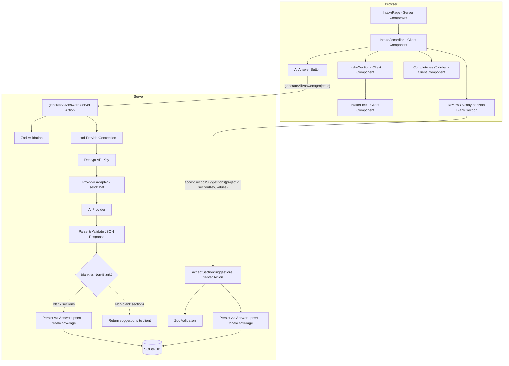
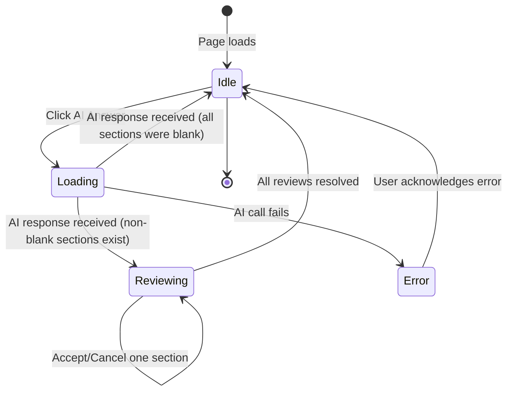

# Intake AI Assist — Design Document

## Overview

The intake AI assist feature adds a page-level "AI Answer" button to the existing intake page that generates answers for all blank fields across all eight intake sections in a single AI call. The feature introduces two distinct post-generation behaviors based on section state at the time of the call:

1. **Blank sections** (no existing answers) — AI-generated values are auto-filled immediately and persisted with source `"ai-inferred"`.
2. **Non-blank sections** (at least one existing answer) — AI-generated values enter a per-section review state where the user can Accept (persist all suggestions) or Cancel (discard suggestions and keep originals).

The design builds on the existing intake module (`src/features/intake/`) and the provider adapter layer (`src/lib/ai/adapters/`). Two new server actions handle the AI call and the accept flow. The existing `saveAnswer` action is reused for individual answer persistence. A new prompt template assembles context from existing answers and blank field definitions.

### Key Design Decisions

1. **Single AI call for all sections** — One request sends all existing answers as context and all blank field definitions as the generation target. This gives the AI maximum context and avoids per-section round trips.

2. **Blank vs. non-blank split** — Blank sections auto-fill because there's nothing to conflict with. Non-blank sections require review because the user has already invested effort there. This balances speed with user control.

3. **Server-side persistence for blank sections** — The `generateAllAnswers` server action persists blank-section answers directly, then returns non-blank suggestions to the client for review. This minimizes client-server round trips for the common case.

4. **Structured JSON response from AI** — The prompt instructs the AI to return a JSON object mapping `sectionKey → fieldKey → value`. The server action validates this structure against the known field definitions before returning results.

5. **Provider adapter layer** — The AI call goes through the existing adapter interface, which will be extended with a `sendChat` method. Provider secrets are decrypted server-side only.

6. **Review state is client-side** — The review UI state (which sections have pending suggestions, Accept/Cancel actions) is managed in the `IntakeAccordion` component. No database state is needed for the review phase.

## Architecture



### Data Flow

1. **Button click**: User clicks "AI Answer". The client calls `generateAllAnswers(projectId)`.
2. **Context assembly**: The server action loads all existing answers and all field definitions. It identifies blank fields, builds a prompt with existing answers as context and blank field definitions as the generation target.
3. **AI call**: The prompt is sent through the provider adapter. The AI returns structured JSON.
4. **Response processing**: The server action validates the JSON against known field definitions. It splits results into blank-section answers and non-blank-section suggestions.
5. **Blank section auto-fill**: Answers for blank sections are persisted immediately (source `"ai-inferred"`), coverage is recalculated, and `revalidatePath` is called.
6. **Non-blank section review**: Suggestions for non-blank sections are returned to the client. The accordion enters review mode for those sections.
7. **Accept/Cancel**: For each non-blank section, the user clicks Accept (calls `acceptSectionSuggestions`) or Cancel (discards client-side suggestions). When all reviews are resolved, the page returns to normal state.

### Module Boundaries

| Module | New/Changed | Responsibility |
|---|---|---|
| `src/features/intake/actions/generate-all-answers.ts` | New | Server action: assemble prompt, call AI, persist blank-section answers, return non-blank suggestions |
| `src/features/intake/actions/accept-section-suggestions.ts` | New | Server action: persist accepted suggestions for one section |
| `src/lib/ai/prompts/intake-answers.ts` | New | Prompt template for generating intake answers |
| `src/lib/ai/adapters/types.ts` | Changed | Add `sendChat` method to `ProviderAdapter` interface |
| `src/lib/ai/adapters/openai-adapter.ts` | Changed | Implement `sendChat` for OpenAI-compatible APIs |
| `src/lib/validation/intake.ts` | Changed | Add Zod schemas for `generateAllAnswers` and `acceptSectionSuggestions` |
| `src/features/intake/components/intake-accordion.tsx` | Changed | Add AI Answer button, review state management, loading/error states |
| `src/features/intake/components/intake-section.tsx` | Changed | Add review overlay with Accept/Cancel actions |

## Components and Interfaces

### Provider Adapter Extension (`src/lib/ai/adapters/types.ts`)

```typescript
export interface ChatMessage {
  role: "system" | "user" | "assistant";
  content: string;
}

export interface ChatOptions {
  temperature?: number;
  maxTokens?: number;
}

export interface ChatResult {
  content: string;
}

export interface ProviderAdapter {
  testConnection(config: ProviderConfig): Promise<ConnectionTestResult>;
  sendChat(config: ProviderConfig, messages: ChatMessage[], options?: ChatOptions): Promise<ChatResult>;
}
```

### Prompt Template (`src/lib/ai/prompts/intake-answers.ts`)

```typescript
export function buildIntakeAnswerPrompt(
  existingAnswers: Record<string, Record<string, string>>,
  blankFields: Record<string, { fieldKey: string; label: string; type: string; helpText: string; options?: string[] }[]>,
): ChatMessage[];
```

The prompt includes:
- A system message explaining the task and expected JSON output format
- Existing answers grouped by section as context
- Blank field definitions with labels, help text, types, and options
- Instructions to return a JSON object: `{ [sectionKey]: { [fieldKey]: value } }`

### Server Action: `generateAllAnswers`

```typescript
// src/features/intake/actions/generate-all-answers.ts
"use server";

export interface GenerateAllAnswersInput {
  projectId: string;
}

export interface GenerateAllAnswersResult {
  success: boolean;
  error?: string;
  /** Suggestions for non-blank sections, keyed by sectionKey → fieldKey → value */
  suggestions?: Record<string, Record<string, string>>;
  /** Section keys that were blank and auto-filled */
  autoFilledSections?: string[];
  /** Section keys that have suggestions pending review */
  reviewSections?: string[];
}

export async function generateAllAnswers(
  input: GenerateAllAnswersInput,
): Promise<GenerateAllAnswersResult>;
```

**Behavior:**
1. Validate input with Zod schema.
2. Load `ProviderConnection` from DB. Return error if none exists.
3. Decrypt the API key using `decrypt()`.
4. Load all `IntakeSection` rows with their `Answer` rows for the project.
5. Identify blank fields across all sections using `INTAKE_SECTIONS` config.
6. If no blank fields exist, return `{ success: true, suggestions: {}, autoFilledSections: [], reviewSections: [] }`.
7. Build the prompt using `buildIntakeAnswerPrompt`.
8. Call the AI provider via `adapter.sendChat()`.
9. Parse the JSON response. Validate each `fieldKey` against the known field definitions for its section.
10. Classify sections as blank or non-blank based on their state before the AI call.
11. For blank sections: persist each answer with source `"ai-inferred"`, recalculate coverage, call `revalidatePath`.
12. For non-blank sections: include suggestions in the response without persisting.
13. Return the result.

### Server Action: `acceptSectionSuggestions`

```typescript
// src/features/intake/actions/accept-section-suggestions.ts
"use server";

export interface AcceptSectionSuggestionsInput {
  projectId: string;
  sectionKey: string;
  values: Record<string, string>;
}

export interface AcceptSectionSuggestionsResult {
  success: boolean;
  error?: string;
  coverageStatus?: string;
}

export async function acceptSectionSuggestions(
  input: AcceptSectionSuggestionsInput,
): Promise<AcceptSectionSuggestionsResult>;
```

**Behavior:**
1. Validate input with Zod schema.
2. Look up the `IntakeSection` by `(projectId, sectionKey)`.
3. For each `fieldKey → value` pair, upsert the `Answer` row with source `"ai-inferred"`.
4. Recalculate coverage for the section.
5. Update `IntakeSection.coverageStatus`.
6. Call `revalidatePath`.
7. Return the result with the new coverage status.

### Client Component Changes

**`IntakeAccordion`** gains:
- `aiState`: `"idle" | "loading" | "reviewing" | "error"` — tracks the overall AI workflow state
- `suggestions`: `Record<string, Record<string, string>>` — pending suggestions for non-blank sections
- `reviewSections`: `Set<string>` — sections currently in review state
- `autoFilledSections`: `string[]` — sections that were auto-filled (for transient feedback)
- `providerConfigured`: `boolean` — passed from the server component to control button enabled state
- AI Answer button rendering with loading/disabled states
- Logic to disable field editing during loading and review states
- Error display for AI generation failures

**`IntakeSection`** gains:
- `reviewSuggestions?: Record<string, string>` — AI suggestions for this section when in review
- `isInReview: boolean` — whether this section is in review state
- `onAccept: () => void` — callback for Accept action
- `onCancel: () => void` — callback for Cancel action
- Review overlay UI showing suggestions alongside existing values
- Accept/Cancel buttons with accessible labels

### Zod Schema Additions (`src/lib/validation/intake.ts`)

```typescript
export const generateAllAnswersSchema = z.object({
  projectId: z.string().min(1, "Project ID is required"),
});

export const acceptSectionSuggestionsSchema = z.object({
  projectId: z.string().min(1, "Project ID is required"),
  sectionKey: sectionKeySchema,
  values: z.record(z.string().min(1), z.string()),
});

export const aiResponseSchema = z.record(
  sectionKeySchema,
  z.record(z.string(), z.string()),
);
```

## Data Models

No new database models are required. The feature uses existing models:

- **ProviderConnection** — read to get the AI provider config and encrypted API key
- **IntakeSection** — read to identify sections and their current state; updated for coverage recalculation
- **Answer** — created/updated with source `"ai-inferred"` for AI-generated values

### State Flow Diagram



### Answer Source Attribution

| Scenario | Source Value |
|---|---|
| User types a value in a field | `"user-form"` |
| AI auto-fills a blank section | `"ai-inferred"` |
| User accepts AI suggestion for a non-blank section | `"ai-inferred"` |
| User later edits an AI-inferred field | `"user-form"` (existing behavior) |

