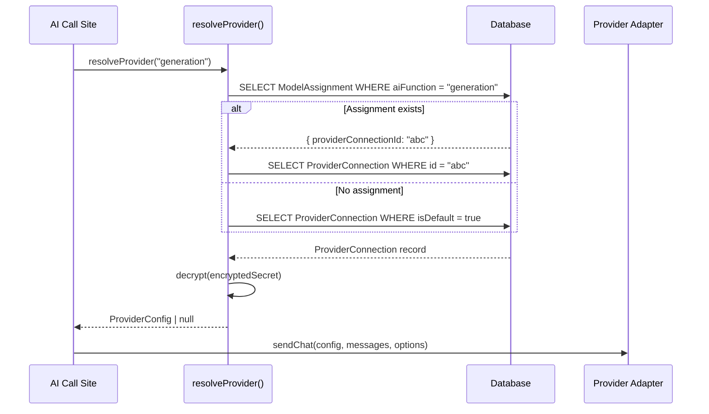
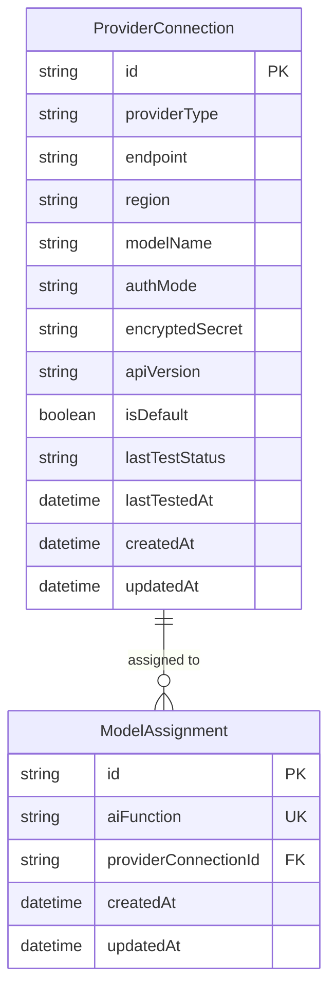

# Design Document: Multi-Model Provider

## Overview

This feature extends Steering Studio from a single-provider model to a multi-provider architecture where users can configure multiple AI model connections and assign them to specific AI functions. The core change introduces a **Function Resolver** that determines which `ProviderConfig` to use for a given AI function (`intake`, `generation`, etc.) by checking for a per-function `ModelAssignment` and falling back to a designated default connection.

The design is additive: the existing `ProviderConnection` model gains an `isDefault` boolean, a new `ModelAssignment` table maps AI functions to connections, and a new `resolveProvider(aiFunction)` module replaces all inline `prisma.providerConnection.findFirst()` calls. The provider settings page is redesigned to show a connection list, an add/edit form, and a model assignments section.

### Key Design Decisions

1. **Additive schema migration**: New nullable `isDefault` column on `ProviderConnection` + new `ModelAssignment` table. No breaking changes. Existing single connection auto-becomes default via application logic.
2. **Centralized resolution**: A single `resolveProvider(aiFunction)` function replaces all scattered provider lookups. Every AI call site uses this function.
3. **UI redesign scope**: The provider settings page becomes a list + form + assignments layout. The documents page already has regeneration buttons; they just need to route through the function resolver.
4. **Enum-as-string for AI functions**: AI function names (`intake`, `generation`) are stored as strings in SQLite, validated by Zod at the application boundary.

## Architecture

```mermaid
graph TD
    subgraph "Provider Settings Page"
        CL[Connection List]
        CF[Add/Edit Form]
        MA[Model Assignments Section]
    end

    subgraph "Server Actions"
        SP[saveProvider]
        DP[deleteProvider]
        SD[setDefault]
        SA[saveAssignment]
        TC[testConnection]
    end

    subgraph "Function Resolver"
        RP[resolveProvider&#40;aiFunction&#41;]
    end

    subgraph "AI Call Sites"
        GA[generateAllAnswers]
        GSA[generateSectionAnswers]
        GD[generateAllDocuments]
        GSD[generateSingleDocument]
        RD[refineDocument]
    end

    subgraph "Database"
        PC[(ProviderConnection)]
        MAT[(ModelAssignment)]
    end

    CL --> SP
    CL --> DP
    CL --> SD
    CL --> TC
    CF --> SP
    MA --> SA

    GA --> RP
    GSA --> RP
    GD --> RP
    GSD --> RP

    RP --> MAT
    RP --> PC
    SA --> MAT
    SP --> PC
    DP --> PC
    DP --> MAT
    SD --> PC
```



### Data Flow for Provider Resolution



## Components and Interfaces

### 1. Function Resolver Module

**File**: `src/lib/ai/resolve-provider.ts`

```typescript
import type { ProviderConfig } from "@/lib/ai/adapters/types";

/** Known AI function identifiers */
export type AiFunction = "intake" | "generation";

/**
 * Resolves the ProviderConfig for a given AI function.
 * Checks ModelAssignment first, falls back to default ProviderConnection.
 * Returns null if no provider is configured.
 */
export async function resolveProvider(
  aiFunction: AiFunction
): Promise<ProviderConfig | null>;
```

This is a pure server-side function. It never returns the raw database record — only a sanitized `ProviderConfig` with the decrypted secret. It must never be imported from client components.

### 2. Updated Server Actions

**`src/features/provider-settings/actions/save-provider.ts`** — Updated to:
- Accept an optional `isDefault` flag
- When creating the first connection, auto-set `isDefault: true`
- When explicitly setting a connection as default, clear `isDefault` on all other connections in a transaction

**`src/features/provider-settings/actions/delete-provider.ts`** (new) — Handles:
- Deleting a `ProviderConnection` by ID
- Clearing any `ModelAssignment` rows that reference the deleted connection
- If the deleted connection was the default, promoting the most recently updated remaining connection to default
- All within a single transaction

**`src/features/provider-settings/actions/save-assignment.ts`** (new) — Handles:
- Upserting a `ModelAssignment` for a given `AiFunction`
- Validating that the referenced `ProviderConnection` exists
- Clearing an assignment (setting it back to default) by deleting the `ModelAssignment` row

### 3. Updated Provider Settings Page

**File**: `src/app/(workspace)/settings/provider/page.tsx`

The server component loads all `ProviderConnection` records and all `ModelAssignment` records, sanitizes them (no secrets), and passes them to a redesigned client component.

**File**: `src/features/provider-settings/components/provider-settings-page.tsx` (new client component)

Layout:
```
┌─────────────────────────────────────────────────┐
│ Provider Connections                             │
│ ┌─────────────────────────────────────────────┐ │
│ │ OpenAI / gpt-4o          [Default] [Test] ✓ │ │
│ │ Azure / o3               [Test] ✓  [Delete] │ │
│ │                          [+ Add Connection]  │ │
│ └─────────────────────────────────────────────┘ │
│                                                  │
│ ┌─────────────────────────────────────────────┐ │
│ │ Add / Edit Connection                        │ │
│ │ (existing form fields, reused)               │ │
│ │ [Save] [Cancel]                              │ │
│ └─────────────────────────────────────────────┘ │
│                                                  │
│ ┌─────────────────────────────────────────────┐ │
│ │ Model Assignments                            │ │
│ │ Intake:     [Default (gpt-4o) ▾]            │ │
│ │ Generation: [Azure / o3         ▾]           │ │
│ └─────────────────────────────────────────────┘ │
└─────────────────────────────────────────────────┘
```

### 4. Updated AI Call Sites

All four call sites that currently do `prisma.providerConnection.findFirst()` inline will be updated to call `resolveProvider(aiFunction)` instead:

| Call Site | AI Function | Current Code | New Code |
|---|---|---|---|
| `generate-all-answers.ts` | `"intake"` | `prisma.providerConnection.findFirst()` | `resolveProvider("intake")` |
| `generate-section-answers.ts` | `"intake"` | `prisma.providerConnection.findFirst()` | `resolveProvider("intake")` |
| `generate-documents.ts` | `"generation"` | `prisma.providerConnection.findFirst()` | `resolveProvider("generation")` |
| `generate-single-document.ts` | `"generation"` | `prisma.providerConnection.findFirst()` | `resolveProvider("generation")` |

Each call site removes its inline `ProviderConfig` construction and `decrypt()` call — that logic moves into `resolveProvider`.

### 5. Validation Schemas

**File**: `src/lib/validation/provider.ts` — Extended with:

```typescript
export const aiFunctionSchema = z.enum(["intake", "generation"]);
export type AiFunction = z.infer<typeof aiFunctionSchema>;

export const saveAssignmentSchema = z.object({
  aiFunction: aiFunctionSchema,
  providerConnectionId: z.string().cuid().optional(), // omit to clear
});

export const deleteProviderSchema = z.object({
  id: z.string().cuid(),
});
```

The existing `saveProviderSchema` is unchanged. A new optional `isDefault` boolean is added to the save flow at the action level (not in the schema, since it's controlled by a separate "Set as Default" action).

## Data Models

### Prisma Schema Changes

```prisma
model ProviderConnection {
  id              String    @id @default(cuid())
  providerType    String
  endpoint        String?
  region          String?
  modelName       String
  authMode        String
  encryptedSecret String?
  apiVersion      String?
  isDefault       Boolean   @default(false)
  lastTestStatus  String?
  lastTestedAt    DateTime?
  createdAt       DateTime  @default(now())
  updatedAt       DateTime  @updatedAt

  modelAssignments ModelAssignment[]
}

model ModelAssignment {
  id                   String             @id @default(cuid())
  aiFunction           String             // "intake" | "generation"
  providerConnectionId String
  providerConnection   ProviderConnection @relation(fields: [providerConnectionId], references: [id], onDelete: Cascade)
  createdAt            DateTime           @default(now())
  updatedAt            DateTime           @updatedAt

  @@unique([aiFunction])
}
```

### Migration Strategy

This is an **additive** change:
1. Add `isDefault Boolean @default(false)` to `ProviderConnection` — new nullable column, no data loss
2. Add `ModelAssignment` table — new table, no data loss
3. Apply with `npx prisma db push` (per tech.md schema migration rules)
4. Run `npx prisma generate` to regenerate the client

**Backward compatibility**: On first load after migration, if no connection has `isDefault = true`, the application logic in the provider settings page and the function resolver will treat the single existing connection as the default. The `resolveProvider` function handles this gracefully:

```typescript
// Fallback: if no isDefault=true exists, use the first connection
const defaultConn = await prisma.providerConnection.findFirst({
  where: { isDefault: true },
}) ?? await prisma.providerConnection.findFirst({
  orderBy: { updatedAt: "desc" },
});
```

### Entity Relationship




## Correctness Properties

*A property is a characteristic or behavior that should hold true across all valid executions of a system — essentially, a formal statement about what the system should do. Properties serve as the bridge between human-readable specifications and machine-verifiable correctness guarantees.*

### Property 1: Assignment-based resolution

*For any* AI function that has a `ModelAssignment` pointing to a valid `ProviderConnection`, `resolveProvider(aiFunction)` should return a `ProviderConfig` whose `providerType`, `modelName`, `endpoint`, `region`, `authMode`, and `apiVersion` match the assigned connection's fields.

**Validates: Requirements 3.1**

### Property 2: Default fallback resolution

*For any* AI function that has no `ModelAssignment`, `resolveProvider(aiFunction)` should return the `ProviderConfig` from the `ProviderConnection` where `isDefault = true`. If no connection has `isDefault = true` but connections exist, it should return the most recently updated connection.

**Validates: Requirements 3.2**

### Property 3: Single-connection backward compatibility

*For any* single `ProviderConnection` (regardless of its `isDefault` value) and *for any* AI function with no `ModelAssignment`, `resolveProvider(aiFunction)` should return that connection's config. This ensures the system works identically to the pre-migration single-provider behavior.

**Validates: Requirements 1.2, 6.1, 6.2**

### Property 4: Secret encrypt/decrypt round-trip

*For any* non-empty secret string, encrypting it with `encrypt()` and then decrypting the result with `decrypt()` should produce the original string. Additionally, `resolveProvider` should include the decrypted plaintext secret in the returned `ProviderConfig` when the connection has an `encryptedSecret`.

**Validates: Requirements 3.4**

### Property 5: Additive connection save

*For any* set of existing `ProviderConnection` records and *for any* valid new connection data, saving the new connection should result in the total connection count increasing by one, all previous connections remaining unchanged, and the new connection storing all provided fields correctly.

**Validates: Requirements 5.1, 5.5**

### Property 6: Auto-default on first connection

*For any* valid connection data, when no `ProviderConnection` records exist, saving the connection should result in that connection having `isDefault = true`.

**Validates: Requirements 1.3**

### Property 7: Default change applies to unassigned functions

*For any* set of connections and *for any* AI function without a `ModelAssignment`, after changing the default to a different connection, `resolveProvider(aiFunction)` should return the newly designated default connection's config.

**Validates: Requirements 1.4**

### Property 8: Delete connection cascades correctly

*For any* `ProviderConnection` that is deleted: (a) all `ModelAssignment` rows referencing it should be removed, and (b) if the deleted connection was the default, the most recently updated remaining connection should become the new default, or no default should exist if no connections remain.

**Validates: Requirements 1.5, 5.4**

### Property 9: Assignment uniqueness per function

*For any* AI function, saving a `ModelAssignment` twice (possibly to different connections) should result in exactly one `ModelAssignment` row for that function, pointing to the most recently saved connection.

**Validates: Requirements 8.2**

### Property 10: Clearing assignment reverts to default

*For any* AI function that has a `ModelAssignment`, clearing that assignment and then calling `resolveProvider(aiFunction)` should return the default connection's config (same result as if the assignment never existed).

**Validates: Requirements 2.4**

### Property 11: Assignment validation rejects invalid connection IDs

*For any* string that does not correspond to an existing `ProviderConnection` ID, attempting to save a `ModelAssignment` with that ID should fail with a validation error, and no `ModelAssignment` should be created or modified.

**Validates: Requirements 2.6**

### Property 12: Connection list displays required fields

*For any* list of `ProviderConnection` records, the rendered connection list should display each connection's provider type, model name, last test status, and a "Default" indicator on exactly the connection where `isDefault = true`.

**Validates: Requirements 1.1, 4.4, 5.2**

### Property 13: Unassigned functions show default label

*For any* AI function that has no `ModelAssignment`, the Model Assignments UI section should display "Default" as the assigned model for that function.

**Validates: Requirements 2.2**

### Property 14: Regeneration notification on generation function change

*For any* save operation that changes the `ProviderConnection` or `ModelAssignment` affecting the `generation` AI function, the system should signal that existing documents may benefit from regeneration.

**Validates: Requirements 7.1**

### Property 15: Overwrite warning for manually edited documents

*For any* `GeneratedDocument` with `manuallyEdited = true`, triggering regeneration should produce a warning before overwriting the document's content.

**Validates: Requirements 7.5**

## Error Handling

### Provider Resolution Errors

| Scenario | Behavior |
|---|---|
| No connections exist | `resolveProvider` returns `null`. Call sites display "No AI provider configured" warning. |
| Assignment references deleted connection | Cannot happen — `onDelete: Cascade` on the relation removes the assignment. If it somehow occurs, resolver falls back to default. |
| Decrypt failure | `resolveProvider` catches the error, logs it, returns `null`. Call site shows "Failed to decrypt provider credentials" warning. |
| Unknown AI function string | Zod validation rejects at the action boundary before reaching the resolver. |

### Save/Delete Action Errors

| Scenario | Behavior |
|---|---|
| Save with invalid data | Zod validation returns error before database write. |
| Delete non-existent connection | Prisma throws `RecordNotFound`. Action catches and returns `{ success: false, error: "Connection not found." }`. |
| Save assignment with non-existent connection ID | Action validates existence before upserting. Returns `{ success: false, error: "Provider connection not found." }`. |
| Transaction failure during delete + cascade | Prisma transaction rolls back. Action returns generic error. No partial state. |

### UI Error States

| Scenario | UI Behavior |
|---|---|
| Save fails | Error banner above the form with the error message. |
| Test connection fails | Red result banner below the tested connection with the failure message. |
| Delete fails | Error toast or inline error on the connection card. |
| No provider configured | Warning message on documents page and intake page explaining that AI features require a provider. |

## Testing Strategy

### Unit Tests

Focus on deterministic logic that doesn't require database or network calls:

- **Validation schemas**: Verify `aiFunctionSchema`, `saveAssignmentSchema`, `deleteProviderSchema` accept valid inputs and reject invalid ones.
- **Default promotion logic**: Pure function that picks the next default from a list of connections.
- **Regeneration notification logic**: Pure function that determines if a save operation affects the `generation` function.
- **Connection list rendering**: Component renders correct indicators for default, test status, and model info.
- **Assignment display logic**: Component shows "Default" for unassigned functions and the connection name for assigned ones.

### Property-Based Tests

Use `fast-check` as the property-based testing library. Each test runs a minimum of 100 iterations and references its design document property.

| Property | Test Description | Generator Strategy |
|---|---|---|
| P1: Assignment-based resolution | Generate random connections + assignment, verify resolver returns assigned config | Random ProviderConnection arrays + random ModelAssignment |
| P2: Default fallback resolution | Generate random connections (one default) + no assignment, verify resolver returns default | Random connections with one `isDefault=true` |
| P3: Single-connection backward compat | Generate one random connection (isDefault true or false), verify resolver returns it for all functions | Single random connection + random AiFunction |
| P4: Secret round-trip | Generate random strings, encrypt then decrypt, verify equality | `fc.string()` with various lengths |
| P5: Additive connection save | Generate N existing connections + new connection data, verify count and field preservation | Random connection arrays + random new connection |
| P6: Auto-default on first connection | Generate random connection data, save to empty DB, verify isDefault | Random SaveProviderInput |
| P7: Default change | Generate connections + change default, verify resolver for unassigned functions | Random connections + random target default |
| P8: Delete cascades | Generate connections + assignments, delete one, verify cascade | Random connections with assignments |
| P9: Assignment uniqueness | Save assignment twice for same function, verify single row | Random AiFunction + two random connection IDs |
| P10: Clear assignment reverts | Create assignment then clear, verify resolver returns default | Random function + connection + default |
| P11: Invalid ID rejection | Generate non-existent CUIDs, verify save fails | `fc.string()` filtered to non-matching IDs |

Each property test must include a comment tag:
```
// Feature: multi-model-provider, Property {N}: {title}
```

### Integration Tests

- **Full resolution flow**: Create connections and assignments via server actions, then call `resolveProvider` and verify the correct config is returned.
- **Delete cascade flow**: Create connections with assignments, delete a connection, verify assignments are cleaned up and default is promoted.
- **Save + test connection flow**: Save a connection, test it (with mocked adapter), verify test status is persisted.

### End-to-End Tests (Playwright)

- **Add multiple connections**: Navigate to provider settings, add two connections, verify both appear in the list.
- **Set default**: Click "Set as Default" on a non-default connection, verify the indicator moves.
- **Assign model to function**: Select a connection for the `generation` function in the assignments section, verify it persists after page reload.
- **Delete connection with assignment**: Delete a connection that has an assignment, verify the assignment reverts to "Default".
- **Single connection backward compat**: With one connection, verify the page works without interacting with assignments.
