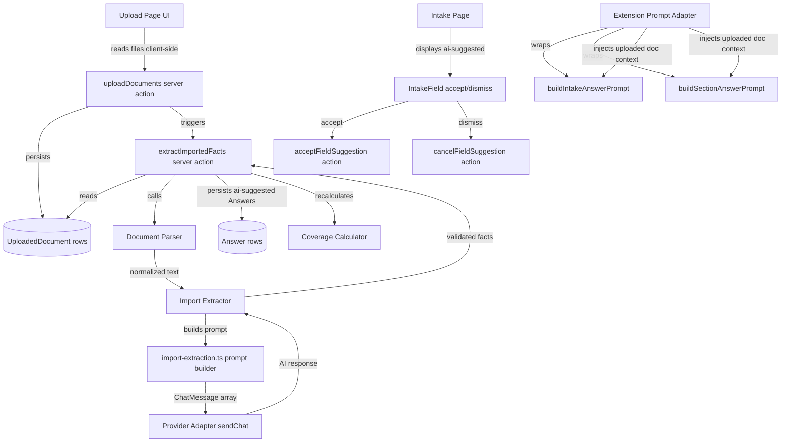
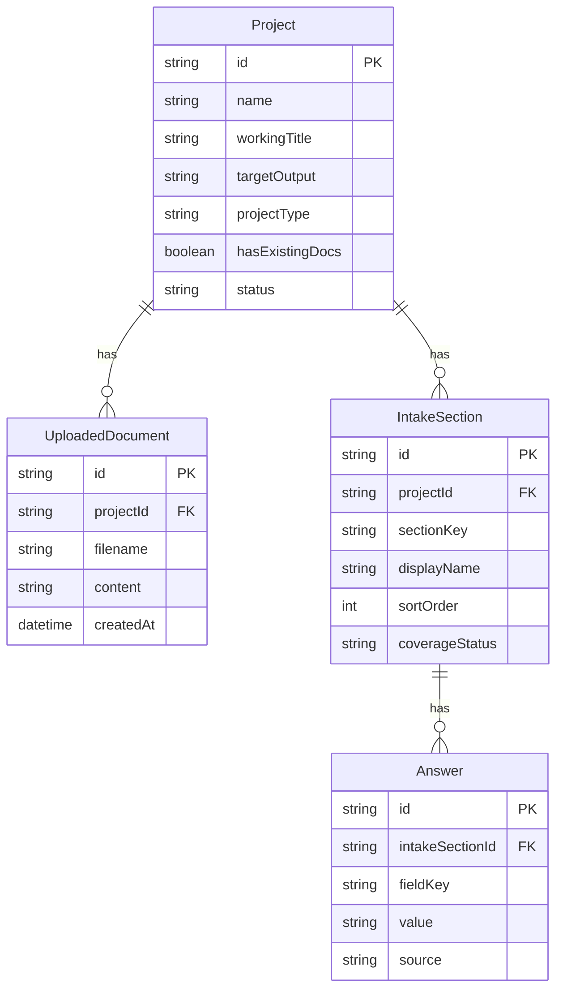

# Design Document: Project Type and Import

## Overview

This feature adds a document import and AI extraction pipeline to Steering Studio for "extension" projects. When a user creates a project with `projectType: "extension"` and `hasExistingDocs: true`, the system presents an upload step where they can provide existing markdown files. The system parses these files, sends them to the configured AI provider for structured fact extraction, and pre-fills the intake form with the results as `ai-suggested` answers. The user reviews and accepts/dismisses these suggestions using the existing intake field controls.

The feature also introduces extension-aware prompt adapters that modify AI behavior for both intake answer generation and future document generation, framing prompts around "what's changing" rather than "what are you building from scratch."

### Key Design Decisions

1. **Client-side file reading**: Files are read as text in the browser and sent as string payloads to server actions. This avoids multipart upload infrastructure and keeps the server action pattern consistent with the rest of the app.
2. **Reuse of `ai-suggested` source**: Extracted facts use the same `ai-suggested` Answer source that the existing intake AI generation uses, so the accept/dismiss UI works without modification.
3. **Single extraction prompt**: All uploaded documents are concatenated and sent in one prompt rather than per-file extraction. This gives the AI cross-document context and reduces API calls.
4. **Modular prompt modules**: The extraction prompt and extension prompt adapter are separate modules from the existing intake answer prompt, following the project's prompt organization pattern.

## Architecture



### Data Flow Summary

1. User selects markdown files → client reads as text → `uploadDocuments` server action persists `UploadedDocument` rows
2. `extractImportedFacts` server action loads documents → `DocumentParser` normalizes → `ImportExtractor` builds prompt → `ProviderAdapter.sendChat` → AI returns JSON → validated facts persisted as `ai-suggested` Answers
3. User navigates to intake → existing `IntakeField` renders suggestions with accept/dismiss → existing actions handle promotion/deletion
4. For intake AI generation on extension projects, `ExtensionPromptAdapter` wraps existing prompt builders to inject uploaded document context and extension framing

## Components and Interfaces

### New Route: `/projects/[projectId]/upload`

**File**: `src/app/(workspace)/projects/[projectId]/upload/page.tsx`

Server component that:
- Loads the project and checks `projectType === "extension" && hasExistingDocs === true`
- Redirects to `/projects/[projectId]/intake` if conditions are not met
- Loads existing `UploadedDocument` records to show previously uploaded files
- Renders the `UploadForm` client component

### UploadForm Component

**File**: `src/features/upload/components/upload-form.tsx`

Client component responsible for:
- File picker restricted to `.md` / `.markdown` extensions
- Drag-and-drop zone
- File list with individual remove actions
- Client-side validation (max 500 KB per file, max 20 files)
- Reading files as text via `FileReader`
- Calling `uploadDocuments` server action
- Calling `extractImportedFacts` server action
- Displaying progress states: "Uploading files...", "Analyzing documents..."
- Displaying extraction summary or error with retry
- "Continue to Intake" and "Skip" navigation

### Server Actions

#### `uploadDocuments`

**File**: `src/features/upload/actions/upload-documents.ts`

```typescript
interface UploadDocumentsInput {
  projectId: string;
  files: { filename: string; content: string }[];
}

interface UploadDocumentsResult {
  success: boolean;
  error?: string;
  documentCount?: number;
}
```

- Validates input with `uploadDocumentsSchema`
- If existing documents exist for the project, deletes them and all `ai-suggested` Answers in a transaction
- Creates `UploadedDocument` rows in a single transaction
- Revalidates the project path

#### `extractImportedFacts`

**File**: `src/features/upload/actions/extract-imported-facts.ts`

```typescript
interface ExtractImportedFactsInput {
  projectId: string;
}

interface ExtractImportedFactsResult {
  success: boolean;
  error?: string;
  factCount?: number;
  sectionsAffected?: number;
}
```

- Loads `UploadedDocument` records for the project
- Loads `ProviderConnection` (returns error if not configured)
- Calls `DocumentParser.parse()` to normalize documents
- Calls `ImportExtractor.extract()` with parsed payload
- Validates AI response against known section/field keys
- Persists valid facts as `ai-suggested` Answer rows (skipping fields with existing user-confirmed answers)
- Recalculates coverage for affected sections
- Revalidates the intake path

### Document Parser Module

**File**: `src/features/upload/lib/document-parser.ts`

```typescript
interface ParsedDocumentPayload {
  text: string;
  truncated: boolean;
  documentCount: number;
}

function parseDocuments(
  documents: { filename: string; content: string }[]
): ParsedDocumentPayload
```

- Strips YAML front matter (content between `---` delimiters at the start of each document)
- Concatenates documents with boundary markers: `\n\n--- Document: {filename} ---\n\n`
- Preserves markdown headings, lists, and code blocks
- Truncates combined payload to 100,000 characters with appended truncation notice

### Import Extractor Module

**File**: `src/features/upload/lib/import-extractor.ts`

```typescript
interface ExtractionResult {
  success: boolean;
  facts: Record<string, Record<string, string>>;
  error?: string;
}

async function extractFacts(
  parsedPayload: string,
  providerConfig: ProviderConfig,
  secret?: string,
): Promise<ExtractionResult>
```

- Builds the extraction prompt using `buildImportExtractionPrompt`
- Calls `ProviderAdapter.sendChat`
- Strips markdown code fences from response
- Parses JSON and validates against `aiResponseSchema`
- Filters to valid section/field keys
- Returns structured facts

### Import Extraction Prompt Builder

**File**: `src/lib/ai/prompts/import-extraction.ts`

```typescript
function buildImportExtractionPrompt(
  documentPayload: string,
  fieldDefinitions: IntakeSectionDef[],
): ChatMessage[]
```

- System message instructs the AI to extract facts from uploaded documents
- Includes the full list of section keys, field keys, labels, and help text from `INTAKE_SECTIONS`
- Instructs the AI to return JSON in the `{ sectionKey: { fieldKey: value } }` format
- Instructs the AI to only extract explicitly stated or strongly implied facts
- Instructs the AI to use exact field/section keys
- Instructs the AI to return empty strings for fields with no relevant information
- User message includes the parsed document payload

### Extension Prompt Adapter

**File**: `src/lib/ai/prompts/extension-prompt-adapter.ts`

```typescript
function adaptIntakePromptForExtension(
  messages: ChatMessage[],
  uploadedDocumentSummary?: string,
): ChatMessage[]

function adaptSectionPromptForExtension(
  messages: ChatMessage[],
  uploadedDocumentSummary?: string,
): ChatMessage[]
```

- Wraps existing prompt builder output
- Prepends extension context to the system message: "The user is extending an existing project. Frame suggestions around changes, additions, and overrides rather than greenfield definitions."
- If uploaded documents exist, appends a summary of uploaded document content as additional context
- Preserves the existing JSON response format instructions so validation logic remains compatible

### Validation Schemas

**File**: `src/lib/validation/upload.ts`

```typescript
// Upload server action input
const uploadDocumentsSchema = z.object({
  projectId: z.string().min(1),
  files: z.array(
    z.object({
      filename: z.string().regex(/\.(md|markdown)$/i, "File must be .md or .markdown"),
      content: z.string().min(1, "File content must not be empty"),
    })
  ).min(1).max(20),
});

// Re-export extraction response schema (reuses aiResponseSchema from intake.ts)
const extractionResponseSchema = aiResponseSchema;
```

### Setup Checklist Integration

**File**: Modified in `src/app/(workspace)/projects/[projectId]/page.tsx`

- When `projectType === "extension" && hasExistingDocs === true`, insert an "Upload Documents" step between "Project created" and "Intake started"
- Step is marked complete when at least one `UploadedDocument` exists for the project
- Step links to `/projects/[projectId]/upload`
- When conditions are not met, the step is omitted entirely


## Data Models

### New Model: UploadedDocument

```prisma
model UploadedDocument {
  id        String   @id @default(cuid())
  projectId String
  project   Project  @relation(fields: [projectId], references: [id], onDelete: Cascade)
  filename  String
  content   String
  createdAt DateTime @default(now())
}
```

**Relation to Project**: Add `uploadedDocuments UploadedDocument[]` to the `Project` model.

### Answer Model Changes

No schema changes needed. The existing `source` column already supports `"ai-suggested"` as a value (validated by `fieldSourceSchema` in `src/lib/validation/intake.ts`). The extraction pipeline writes Answer rows with `source: "ai-suggested"`, which the existing intake UI already handles with accept/dismiss controls.

### Migration Strategy

This is an additive change (new model, new relation). Use `npx prisma db push` to apply without data loss, per the project's schema migration rules.

### Entity Relationship




## Correctness Properties

*A property is a characteristic or behavior that should hold true across all valid executions of a system — essentially, a formal statement about what the system should do. Properties serve as the bridge between human-readable specifications and machine-verifiable correctness guarantees.*

### Property 1: Upload access control predicate

*For any* project configuration, the upload page should be accessible (not redirect) if and only if `projectType === "extension"` AND `hasExistingDocs === true`. All other combinations should redirect to the intake page.

**Validates: Requirements 1.2, 1.3**

### Property 2: Upload validation schema accepts valid inputs and rejects invalid ones

*For any* upload input, the validation schema should accept it if and only if: `projectId` is a non-empty string, `files` is an array of 1–20 objects where each has a `filename` ending in `.md` or `.markdown` (case-insensitive) and a non-empty `content` string. Inputs violating any of these constraints should be rejected.

**Validates: Requirements 2.5, 2.6, 3.3, 13.1**

### Property 3: Document parser preserves all document content with boundary markers

*For any* set of documents with filenames and content, the parsed output should contain every filename in a boundary marker and every non-front-matter content segment. Markdown headings, lists, and code blocks in the input should appear unchanged in the output.

**Validates: Requirements 4.1, 4.3**

### Property 4: Document parser strips YAML front matter

*For any* document containing YAML front matter (content between `---` delimiters at the start), the parsed output should not contain the front matter block, but should contain all content after the closing `---` delimiter.

**Validates: Requirements 4.2**

### Property 5: Document parser truncation

*For any* set of documents whose combined content exceeds 100,000 characters, the parsed output text length should not exceed 100,000 characters (plus truncation notice), and the `truncated` flag should be `true`. For combined content within the limit, `truncated` should be `false` and all content should be present.

**Validates: Requirements 4.4**

### Property 6: Extraction prompt builder includes all intake field definitions and document payload

*For any* document payload string and the full intake section definitions, the prompt builder should return a `ChatMessage[]` array where the system message contains every section key and field key from the intake configuration, and the document payload text appears in the messages.

**Validates: Requirements 5.2, 5.3, 12.2, 12.3, 12.4, 12.5**

### Property 7: Extraction response filtering discards invalid keys

*For any* AI response JSON object containing a mix of valid and invalid section/field keys, the filtering logic should retain only entries whose section key exists in `INTAKE_SECTIONS` and whose field key exists in that section's field definitions. All other entries should be discarded.

**Validates: Requirements 5.5**

### Property 8: Extracted facts do not overwrite user-confirmed answers

*For any* set of extracted facts and any set of pre-existing Answer rows with source `"user-form"` or `"ai-conversation"`, the persistence logic should only create `ai-suggested` Answer rows for fields that do not already have a user-confirmed answer. Pre-existing user-confirmed answers should remain unchanged.

**Validates: Requirements 6.1, 6.2**

### Property 9: Re-upload clears stale ai-suggested answers

*For any* project with existing `ai-suggested` Answer rows, when the user replaces uploaded documents, all `ai-suggested` Answer rows for that project should be deleted before new extraction results are persisted.

**Validates: Requirements 8.3**

### Property 10: Extension prompt adapter injects extension context while preserving format

*For any* set of `ChatMessage[]` from the existing prompt builders, when adapted for an extension project, the output should contain extension framing text (e.g., "extending an existing project") in the system message. When uploaded document content is provided, it should appear in the adapted messages. The JSON response format instructions from the original prompt should be preserved in the adapted output.

**Validates: Requirements 9.1, 9.2, 9.3, 9.4**

### Property 11: Setup checklist conditionally includes upload step

*For any* project configuration, the setup checklist should include an "Upload Documents" step if and only if `projectType === "extension"` AND `hasExistingDocs === true`. When included, the step should be marked complete if and only if at least one `UploadedDocument` record exists for the project.

**Validates: Requirements 11.1, 11.2, 11.4**

## Error Handling

### Upload Phase Errors

| Error Condition | Detection Point | User-Facing Behavior |
|---|---|---|
| File exceeds 500 KB | Client-side, before upload | Validation message identifying the oversized file; file excluded from selection |
| More than 20 files selected | Client-side, before upload | Validation message stating the 20-file limit |
| File cannot be read as text | Client-side `FileReader.onerror` | Error message identifying the problematic file; file excluded from upload |
| Server action persistence failure | `uploadDocuments` action catch block | Error message with "Retry" button to re-attempt upload |
| Invalid file extension | Server-side Zod validation | Error message from schema validation returned to client |

### Extraction Phase Errors

| Error Condition | Detection Point | User-Facing Behavior |
|---|---|---|
| No ProviderConnection configured | `extractImportedFacts` action, before AI call | Message directing user to configure provider in Settings, with link to `/settings/provider` |
| Provider API network/timeout error | `ProviderAdapter.sendChat` catch block | Error message with "Retry" button; re-triggers extraction using already-persisted documents |
| AI returns invalid JSON | JSON.parse failure after code fence stripping | Error message: "AI returned an invalid response. Please try again." with "Retry" button |
| AI returns valid JSON but wrong schema | `aiResponseSchema` validation failure | Error message: "AI returned an invalid response format. Please try again." with "Retry" button |
| No facts extracted (all fields empty) | Post-validation check | Success state with "0 facts extracted" summary; user can proceed to intake |

### Design Principles for Error Handling

1. **Retry over restart**: Extraction errors should allow retry without re-uploading files, since documents are already persisted.
2. **Graceful degradation**: If extraction fails entirely, the user can skip to intake and fill fields manually.
3. **Server-side validation**: All inputs are validated with Zod schemas at the server action boundary, consistent with the existing pattern in `generate-all-answers.ts` and `generate-section-answers.ts`.
4. **Error shape consistency**: All server actions return `{ success: boolean; error?: string }`, matching the existing action result pattern.

## Testing Strategy

### Unit Tests

Focus on pure transformation functions that can be tested without database or AI provider:

- **Document parser** (`document-parser.ts`): front matter stripping, boundary marker insertion, markdown preservation, truncation behavior
- **Upload validation schema** (`upload.ts`): valid/invalid filename extensions, empty content, file count limits
- **Extraction response filtering**: valid/invalid key filtering against `INTAKE_SECTIONS`
- **Extension prompt adapter**: extension framing injection, document context injection, format preservation
- **Checklist logic**: conditional upload step inclusion based on project configuration

### Property-Based Tests

Each correctness property above should be implemented as a property-based test using `fast-check`. Minimum 100 iterations per property.

| Property | Test File | Generator Strategy |
|---|---|---|
| Property 1: Upload access control | `src/features/upload/lib/__tests__/access-control.pbt.test.ts` | Generate random `{ projectType, hasExistingDocs }` combinations |
| Property 2: Upload validation | `src/lib/validation/__tests__/upload.pbt.test.ts` | Generate random filenames (valid/invalid extensions), content strings, file counts |
| Property 3: Parser content preservation | `src/features/upload/lib/__tests__/document-parser.pbt.test.ts` | Generate random documents with filenames and markdown content |
| Property 4: Parser front matter stripping | `src/features/upload/lib/__tests__/document-parser.pbt.test.ts` | Generate documents with random YAML front matter blocks |
| Property 5: Parser truncation | `src/features/upload/lib/__tests__/document-parser.pbt.test.ts` | Generate document sets with combined sizes above and below 100K chars |
| Property 6: Prompt builder completeness | `src/lib/ai/prompts/__tests__/import-extraction.pbt.test.ts` | Generate random document payloads, verify all section/field keys present |
| Property 7: Response filtering | `src/features/upload/lib/__tests__/import-extractor.pbt.test.ts` | Generate response objects with random valid and invalid keys |
| Property 8: Fact persistence skips confirmed | `src/features/upload/lib/__tests__/import-extractor.pbt.test.ts` | Generate fact sets with overlapping pre-existing confirmed answers |
| Property 10: Extension prompt adapter | `src/lib/ai/prompts/__tests__/extension-prompt-adapter.pbt.test.ts` | Generate random ChatMessage arrays and document summaries |
| Property 11: Checklist conditional step | `src/app/(workspace)/projects/[projectId]/__tests__/checklist.pbt.test.ts` | Generate random project configs and document counts |

Tag format: `Feature: project-type-and-import, Property {N}: {title}`

### Integration Tests

Cover server action flows with mocked AI provider:

- `uploadDocuments` action: persists documents, handles re-upload replacement, validates inputs
- `extractImportedFacts` action: end-to-end flow with mocked `sendChat`, verifies Answer rows created with correct source
- Re-upload flow: verifies old documents and stale suggestions are deleted before new ones are inserted

### E2E Tests (Playwright)

Cover the user journey:

1. Create extension project with `hasExistingDocs: true`
2. Navigate to upload page, verify it renders
3. Upload markdown files, verify progress states
4. Verify extraction summary displays
5. Navigate to intake, verify ai-suggested answers appear with accept/dismiss controls
6. Verify "new" project redirects away from upload page
7. Verify skip link works

### Testing Library

- **Property-based testing**: `fast-check` (already available in the ecosystem for TypeScript/Vitest)
- **Unit/integration**: Vitest
- **E2E**: Playwright

