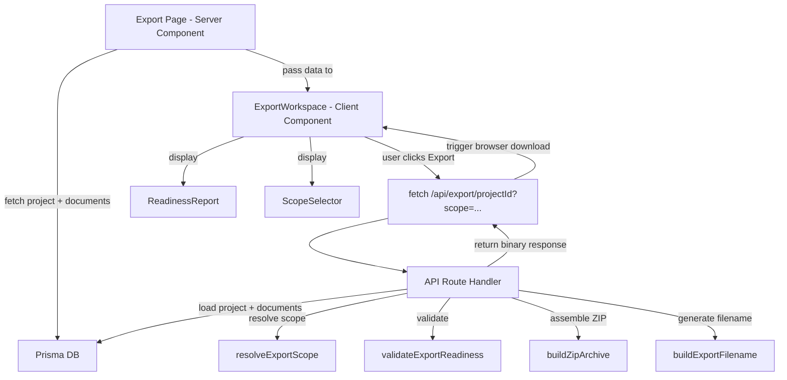
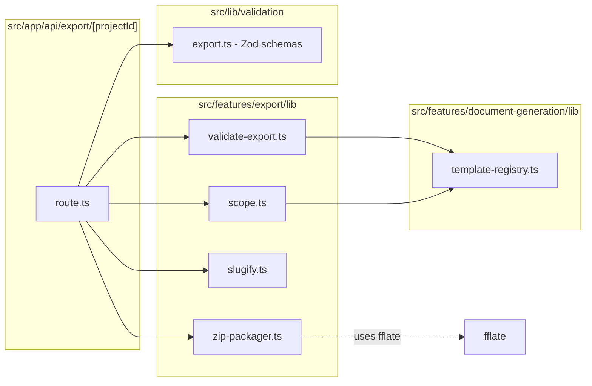

# Design Document: ZIP Export

## Overview

The ZIP Export feature is the final step in the Steering Studio workflow. It provides a server-side API route that assembles generated documents into a ZIP archive and a client-side export page that validates readiness, lets the user choose an export scope, and triggers a browser file download.

The feature is composed of four pure-logic modules (export validator, ZIP packager, filename slugifier, scope resolver) and a thin API route that orchestrates them. The export page is a server component that fetches project data and delegates interactivity to a client `ExportWorkspace` component.

### Key Design Decisions

1. **fflate for ZIP creation** — lightweight, fast, works in Node.js, no native dependencies. Added to `dependencies` in `package.json`.
2. **Pure functions for all logic** — the validator, packager, and slugifier are pure functions that accept data and return results. No side effects, fully testable without mocking.
3. **Server-side ZIP assembly** — document content stays on the server. The client only receives the final binary blob via `fetch`.
4. **Scope derived from template registry** — the existing `getTemplatesForTarget()` is the single source of truth for which file paths belong to which target. The export feature reuses it rather than duplicating path lists.

## Architecture

### Data Flow



### Module Dependency Graph



## Components and Interfaces

### Pure Logic Modules (`src/features/export/lib/`)

#### `scope.ts` — Export Scope Resolution

```typescript
import type { TargetOutput } from "@/lib/validation";
import type { TemplateDefinition } from "@/features/document-generation/lib/template-registry";

export type ExportScope = "all" | "kiro" | "copilot";

/**
 * Returns the allowed scopes for a given project target output.
 * - "Kiro" → ["kiro"]
 * - "Copilot" → ["copilot"]
 * - "Both" → ["all", "kiro", "copilot"]
 */
export function getAllowedScopes(targetOutput: TargetOutput): ExportScope[];

/**
 * Returns the default scope for a given project target output.
 * - "Kiro" → "kiro"
 * - "Copilot" → "copilot"
 * - "Both" → "all"
 */
export function getDefaultScope(targetOutput: TargetOutput): ExportScope;

/**
 * Filters template definitions to only those matching the export scope.
 */
export function getTemplatesForScope(
  scope: ExportScope,
  targetOutput: TargetOutput,
): TemplateDefinition[];
```

#### `validate-export.ts` — Export Readiness Validation

```typescript
export type DocumentStatus = "ready" | "warning" | "missing" | "empty";

export interface DocumentReadiness {
  filePath: string;
  status: DocumentStatus;
  missingFields: string[];
  required: boolean;
}

export interface ReadinessResult {
  documents: DocumentReadiness[];
  summary: { ready: number; warning: number; missing: number; empty: number };
  canExport: boolean;       // true when no required docs are missing or empty
  allReady: boolean;        // true when every doc is "ready"
}

/**
 * Pure function. Compares generated documents against expected templates
 * for the given scope and returns a structured readiness report.
 */
export function validateExportReadiness(
  generatedDocs: Array<{
    filePath: string;
    content: string;
    completeness: string;
    missingFields: string;
  }>,
  expectedTemplates: Array<{ filePath: string; required: boolean }>,
): ReadinessResult;
```

Logic:
- For each expected template, find the matching generated document by `filePath`.
- If no match → status `"missing"`.
- If match but `content` is empty string → status `"empty"`.
- If match and `completeness === "partial"` → status `"warning"`, parse `missingFields` JSON.
- Otherwise → status `"ready"`.
- `canExport` is `true` when no required document has status `"missing"` or `"empty"`.
- `allReady` is `true` when every document has status `"ready"`.

#### `zip-packager.ts` — ZIP Archive Assembly

```typescript
/**
 * Pure function. Takes an array of file entries and returns a ZIP buffer.
 * Uses fflate's zipSync for synchronous in-memory compression.
 */
export function buildZipArchive(
  files: Array<{ path: string; content: string }>,
): Uint8Array;
```

Implementation uses `fflate.zipSync()` which accepts an object mapping paths to content. Each `content` string is encoded to `Uint8Array` via `TextEncoder`.

#### `slugify.ts` — Filename Slugifier

```typescript
/**
 * Pure function. Converts a project name to a URL/filename-safe slug.
 * - lowercases
 * - replaces spaces and special characters with hyphens
 * - collapses consecutive hyphens
 * - trims leading/trailing hyphens
 */
export function slugify(input: string): string;

/**
 * Builds the full ZIP filename.
 * Pattern: steering-studio-{slug}-{scopeSegment}.zip
 * Scope mapping: "all" → "both", "kiro" → "kiro", "copilot" → "copilot"
 */
export function buildExportFilename(
  projectName: string,
  scope: ExportScope,
): string;
```

### API Route (`src/app/api/export/[projectId]/route.ts`)

```typescript
import { NextResponse } from "next/server";

export async function GET(
  request: Request,
  { params }: { params: Promise<{ projectId: string }> },
): Promise<NextResponse>;
```

Handler steps:
1. Parse and validate `projectId` from route params and `scope` from query string using Zod.
2. Load project from Prisma (select `name`, `targetOutput`).
3. Return 404 if project not found.
4. Validate that `scope` is allowed for the project's `targetOutput`.
5. Resolve expected templates via `getTemplatesForScope()`.
6. Load generated documents from Prisma for the project.
7. Filter documents to those matching the scope's file paths.
8. Return 404 if no documents match.
9. Build ZIP via `buildZipArchive()`.
10. Build filename via `buildExportFilename()`.
11. Return `NextResponse` with ZIP body, `Content-Type: application/zip`, and `Content-Disposition: attachment; filename="..."`.

### React Components (`src/features/export/components/`)

#### `ExportWorkspace` (client component)

The main orchestrator for the export page. Receives server-fetched data as props.

```typescript
interface ExportWorkspaceProps {
  projectId: string;
  projectName: string;
  targetOutput: TargetOutput;
  readiness: ReadinessResult;
  defaultScope: ExportScope;
  allowedScopes: ExportScope[];
}
```

State:
- `scope: ExportScope` — current selection
- `isDownloading: boolean` — loading state
- `downloadStatus: "idle" | "success" | "error"` — result feedback
- `errorMessage: string | null`
- `showWarning: boolean` — sensitive content notice

Behavior:
- When scope changes, re-validates readiness client-side (the page passes all documents, client filters).
- On export click: shows sensitive content warning, then fetches `/api/export/[projectId]?scope=...`, triggers download via blob URL, shows success/error.

#### `ScopeSelector`

Renders scope radio buttons. Disabled when only one scope is allowed.

```typescript
interface ScopeSelectorProps {
  scope: ExportScope;
  allowedScopes: ExportScope[];
  onChange: (scope: ExportScope) => void;
}
```

#### `ReadinessReport`

Displays the structured readiness report grouped by status.

```typescript
interface ReadinessReportProps {
  readiness: ReadinessResult;
  projectId: string;
}
```

Shows:
- Summary counts (ready / warning / missing)
- Document list grouped by status with file paths
- Missing fields for warning documents
- "Go to Documents" link when required docs are missing
- "Ready for export" banner when `allReady` is true

#### `ExportEmptyState`

Shown when no generated documents exist. Prompts user to go to the Documents page.

```typescript
interface ExportEmptyStateProps {
  projectId: string;
}
```

### Export Page (`src/app/(workspace)/projects/[projectId]/export/page.tsx`)

Server component that:
1. Loads project (name, targetOutput) from Prisma.
2. Loads all generated documents for the project.
3. Computes `defaultScope`, `allowedScopes` from `targetOutput`.
4. Computes `readiness` by calling `validateExportReadiness()` with the default scope's templates.
5. If no documents exist, renders `ExportEmptyState`.
6. Otherwise renders `ExportWorkspace` with all computed props.

### Zod Validation Schemas (`src/lib/validation/export.ts`)

```typescript
import { z } from "zod/v4";

export const exportScopeSchema = z.enum(["all", "kiro", "copilot"]);

export const exportRequestSchema = z.object({
  projectId: z.string().min(1),
  scope: exportScopeSchema,
});

export type ExportScope = z.infer<typeof exportScopeSchema>;
export type ExportRequestInput = z.infer<typeof exportRequestSchema>;
```

Barrel-exported from `src/lib/validation/index.ts`.

## Data Models

No new Prisma models are needed. The feature reads from existing models:

### Project (read-only)
- `id: string` — used as route param
- `name: string` — used for ZIP filename slug
- `targetOutput: string` — determines allowed export scopes

### GeneratedDocument (read-only)
- `projectId: string` — filter by project
- `filePath: string` — becomes the path inside the ZIP archive
- `content: string` — the file content written into the ZIP
- `completeness: string` — used by the validator ("complete" | "partial" | "empty")
- `missingFields: string` — JSON array, parsed by the validator for warning details

### TemplateDefinition (from template-registry, in-memory)
- `filePath: string` — the expected output path
- `target: "kiro" | "copilot"` — used for scope filtering
- `required: boolean` — determines if a missing doc blocks export

### Data Flow Summary

```
Project.targetOutput → getAllowedScopes() → ExportScope
ExportScope + Project.targetOutput → getTemplatesForScope() → TemplateDefinition[]
TemplateDefinition[] + GeneratedDocument[] → validateExportReadiness() → ReadinessResult
GeneratedDocument[] (filtered by scope) → buildZipArchive() → Uint8Array
Project.name + ExportScope → buildExportFilename() → string
```


## Correctness Properties

*A property is a characteristic or behavior that should hold true across all valid executions of a system — essentially, a formal statement about what the system should do. Properties serve as the bridge between human-readable specifications and machine-verifiable correctness guarantees.*

### Property 1: Validator assigns correct document status

*For any* set of expected templates (with `filePath` and `required` fields) and *any* set of generated documents (with `filePath`, `content`, and `completeness` fields), the validator should assign each expected template the correct status:
- `"missing"` if no generated document matches the template's `filePath`
- `"empty"` if a matching document exists but has empty content
- `"warning"` if a matching document has `completeness === "partial"`, and the result should include the parsed `missingFields`
- `"ready"` if a matching document has non-empty content and `completeness !== "partial"`

**Validates: Requirements 3.1, 3.2, 3.3, 3.4**

### Property 2: Validator summary counts are consistent

*For any* readiness result produced by the validator, the summary counts (`ready`, `warning`, `missing`, `empty`) should each equal the number of documents in the result's document list with that corresponding status, and their sum should equal the total number of documents.

**Validates: Requirements 4.4**

### Property 3: canExport is true iff no required document is missing or empty

*For any* set of expected templates and generated documents, `canExport` should be `true` if and only if no document with `required === true` has a status of `"missing"` or `"empty"`. Documents with `"warning"` status should not block export.

**Validates: Requirements 4.5, 9.1, 9.2**

### Property 4: ZIP archive round-trip preserves paths and content

*For any* non-empty array of file entries (each with a valid path string and content string), building a ZIP archive with `buildZipArchive` and then decompressing it with `fflate.unzipSync` should yield the same set of paths, and decoding each entry should produce the original content string.

**Validates: Requirements 5.1, 5.2, 5.6**

### Property 5: Scope filtering includes only target-appropriate documents

*For any* export scope and target output, the file paths returned by `getTemplatesForScope(scope, targetOutput)` should only include templates whose `target` field matches the scope: `"kiro"` templates for scope `"kiro"`, `"copilot"` templates for scope `"copilot"`, and both for scope `"all"`.

**Validates: Requirements 5.3, 5.4, 5.5**

### Property 6: Slugify produces valid filename segments

*For any* non-empty input string, `slugify` should produce a string that:
- contains only lowercase alphanumeric characters and hyphens
- does not start or end with a hyphen
- does not contain consecutive hyphens
- is non-empty (given non-empty input with at least one alphanumeric character)

**Validates: Requirements 6.2**

### Property 7: Export filename follows the naming convention

*For any* project name (containing at least one alphanumeric character) and *any* valid export scope, `buildExportFilename(projectName, scope)` should produce a string matching the pattern `steering-studio-{slug}-{scopeSegment}.zip` where `{slug}` is the slugified project name and `{scopeSegment}` is `"both"` for scope `"all"`, `"kiro"` for scope `"kiro"`, or `"copilot"` for scope `"copilot"`.

**Validates: Requirements 6.1, 6.3, 6.4, 6.5**

## Error Handling

### API Route Errors

| Condition | HTTP Status | Response Body |
|---|---|---|
| Project ID not found | 404 | `{ error: "Project not found" }` |
| Invalid or missing scope parameter | 400 | `{ error: "Invalid export scope" }` |
| Scope not allowed for project target | 400 | `{ error: "Scope not allowed for this project" }` |
| No documents exist for scope | 404 | `{ error: "No documents available for export" }` |
| ZIP assembly failure | 500 | `{ error: "Failed to generate ZIP archive" }` |

### Client-Side Error Handling

- Network errors during fetch → display generic error message, allow retry
- Non-OK HTTP response → parse error JSON and display the `error` field
- Blob creation failure → display error, allow retry

### Validation Edge Cases

- `missingFields` stored as invalid JSON → treat as empty array, log warning
- Document with `completeness` value outside known set → treat as `"ready"` (defensive)
- Empty project name → slugify returns `"project"` as fallback

## Testing Strategy

### Property-Based Tests (fast-check)

Each correctness property maps to a single property-based test file or test block. Tests use `fast-check` (already in devDependencies) with minimum 100 iterations.

Test files:
- `src/features/export/lib/__tests__/validate-export.pbt.test.ts` — Properties 1, 2, 3
- `src/features/export/lib/__tests__/zip-packager.pbt.test.ts` — Property 4
- `src/features/export/lib/__tests__/scope.pbt.test.ts` — Property 5
- `src/features/export/lib/__tests__/slugify.pbt.test.ts` — Properties 6, 7

Each test must be tagged with a comment: `// Feature: zip-export, Property {N}: {title}`

Configuration: `{ numRuns: 100 }` per property test.

### Unit Tests

- `src/features/export/lib/__tests__/validate-export.test.ts` — specific examples for each status, edge cases (invalid JSON in missingFields, unknown completeness values)
- `src/features/export/lib/__tests__/slugify.test.ts` — specific examples (spaces, special chars, unicode, empty-ish strings)
- `src/features/export/lib/__tests__/scope.test.ts` — specific examples for each TargetOutput → scope mapping
- `src/features/export/lib/__tests__/zip-packager.test.ts` — specific example with known files, verify decompressed output

### Integration Tests

- `src/app/api/export/[projectId]/__tests__/route.test.ts` — test the API route handler with mocked Prisma, verify HTTP status codes, headers, and response bodies for success and error cases

### End-to-End Tests

- Export happy path: create project → generate documents → navigate to export → download ZIP → verify ZIP contents
- Export with warnings: partial documents → verify export still works
- Export blocked: missing required documents → verify button is disabled
